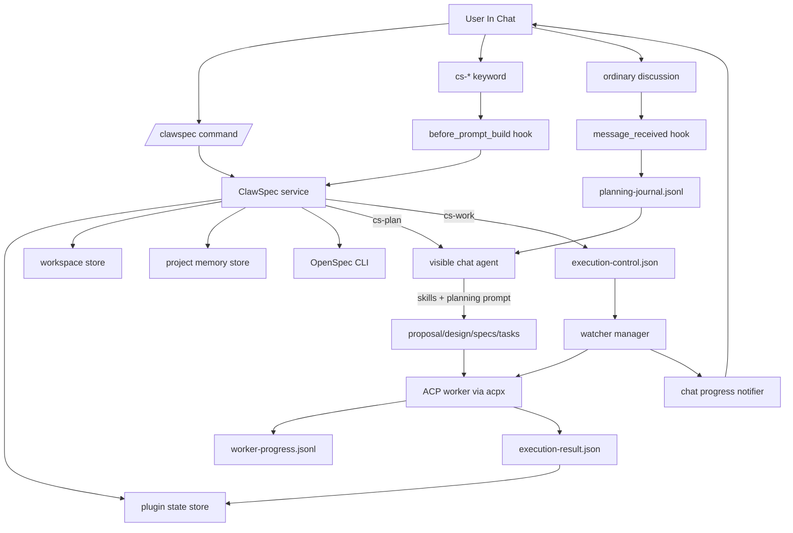
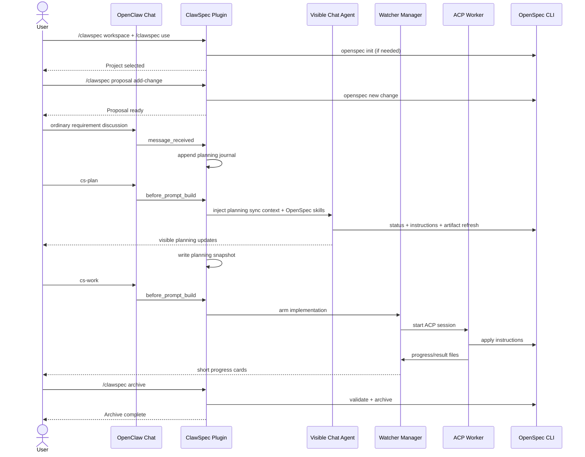
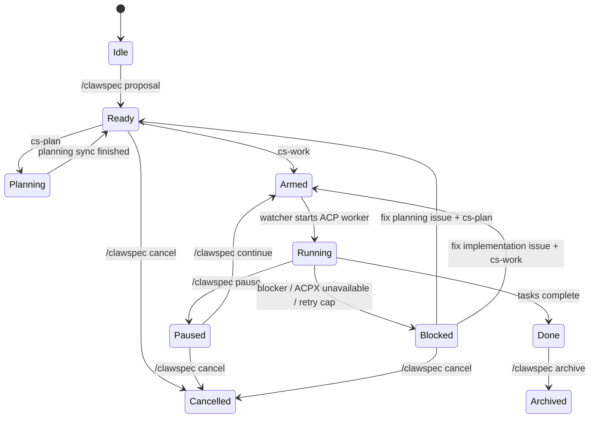

# ClawSpec

[Chinese (Simplified)](./README.zh-CN.md)

ClawSpec is an OpenClaw plugin that embeds an OpenSpec workflow directly into chat. It splits project control and execution on purpose:

- `/clawspec ...` manages workspace, project, change, and recovery state.
- `cs-*` chat keywords trigger work inside the active conversation.
- `cs-plan` runs planning sync in the visible chat turn.
- `cs-work` runs implementation in the background through a watcher and ACP worker, then reports short progress updates back into chat.

The result is an OpenSpec workflow that stays chat-native without hiding long-running implementation work inside the main session.

## At A Glance

- Workspace is remembered per chat channel.
- One active project is tracked per chat channel.
- One unfinished change is enforced per repo across channels.
- Discussion messages are recorded into a planning journal while context is attached.
- `cs-plan` refreshes `proposal.md`, `design.md`, `specs`, and `tasks.md` without implementing code.
- `cs-work` turns `tasks.md` into background execution, with watcher-driven progress and restart handling.
- `/clawspec cancel` restores tracked files from snapshots instead of doing a blanket Git reset.
- `/clawspec archive` validates and archives the finished OpenSpec change, then clears the active change from chat context.

## Why The Surface Is Split

ClawSpec uses two different control surfaces because they solve different problems:

| Surface | Examples | What it does | Why it exists |
| --- | --- | --- | --- |
| Slash command | `/clawspec use`, `/clawspec proposal`, `/clawspec status` | Direct plugin control, file system setup, state inspection | Fast, deterministic, no agent turn required |
| Chat keyword | `cs-plan`, `cs-work`, `cs-pause` | Injects workflow context into the current conversation or queues background execution | Keeps planning visible in chat and lets normal chat remain the primary UX |

In practice:

- Use `/clawspec ...` to set up and manage the project.
- Use `cs-plan` when you want the current visible agent turn to refresh planning artifacts.
- Use `cs-work` when you want the watcher to start background implementation.

## Architecture



## What Runs Where

| Action | Runtime | Visible to user | Writes |
| --- | --- | --- | --- |
| `/clawspec workspace` | Plugin command handler | Immediate command reply | Workspace state |
| `/clawspec use` | Plugin command handler + `openspec init` if needed | Immediate command reply | Workspace/project selection, OpenSpec init |
| `/clawspec proposal` | Plugin command handler + `openspec new change` | Immediate command reply | Change scaffold, snapshots, fresh planning state |
| Ordinary discussion | Main chat agent + prompt injection | Yes | Planning journal, no artifact rewrite |
| `cs-plan` | Main chat agent in the current visible turn | Yes | Planning artifacts, planning journal snapshot |
| `cs-work` | Watcher + ACP worker | Progress updates only | Code changes, `tasks.md`, watcher support files |
| `/clawspec continue` | Plugin decides whether to re-arm planning or implementation | Immediate reply, then either visible planning or background work | Execution state |

## Requirements

- A recent OpenClaw build with plugin hooks and ACP runtime support.
- Node.js `>= 24` on the gateway host.
- `npm` available on the gateway host if OpenSpec must be bootstrapped automatically.
- An OpenClaw agent profile that can run shell commands and edit files for visible planning turns.
- ACP backend `acpx` enabled for background implementation.

ClawSpec depends on these OpenClaw hook points:

- `message_received`
- `before_prompt_build`
- `agent_end`

If your host disables plugin hooks globally, keyword-based workflow will not work correctly.

## Installation

### 1. Install the plugin

Local linked install:

```powershell
openclaw plugins install -l C:\Users\Administrator\rax-plugin\clawspec
```

If you package and publish ClawSpec later, install it the same way you install any other OpenClaw plugin package. The workflow below assumes the plugin is already discoverable by OpenClaw.

### 2. Enable ACP and ACPX in OpenClaw

Example `~/.openclaw/openclaw.json`:

```json
{
  "acp": {
    "enabled": true,
    "backend": "acpx",
    "defaultAgent": "codex"
  },
  "plugins": {
    "entries": {
      "acpx": {
        "enabled": true,
        "config": {
          "permissionMode": "approve-all",
          "expectedVersion": "any"
        }
      },
      "clawspec": {
        "enabled": true,
        "config": {
          "defaultWorkspace": "~/clawspec/workspace",
          "workerAgentId": "codex",
          "openSpecTimeoutMs": 120000,
          "watcherPollIntervalMs": 4000
        }
      }
    }
  }
}
```

Important notes:

- Recent OpenClaw builds often bundle `acpx` under the host install. In that case you usually only need to enable it.
- If your OpenClaw build does not bundle `acpx`, install or load it separately before relying on `cs-work`.
- ClawSpec itself does not ship its own ACP runtime backend.
- When ACPX is unavailable, the watcher now reports a short recovery hint in chat telling the user to enable `plugins.entries.acpx` and backend `acpx`.

### 3. Restart the gateway

```powershell
openclaw gateway restart
openclaw gateway status
```

### 4. Understand OpenSpec bootstrap behavior

On startup ClawSpec checks for `openspec` in this order:

1. Plugin-local binary under `node_modules/.bin`
2. `openspec` on `PATH`
3. If missing, it may run:

```powershell
npm install --omit=dev --no-save @fission-ai/openspec
```

That means the gateway host may need network access and a working `npm` if `openspec` is not already available.

## Quick Start

```text
/clawspec workspace "D:\dev"
/clawspec use "demo-app"
/clawspec proposal add-login-flow "Build login and session handling"
Describe the requirement in chat
cs-plan
cs-work
/clawspec status
/clawspec archive
```

What happens:

1. `/clawspec workspace` selects the workspace for this chat channel.
2. `/clawspec use` selects or creates a repo folder under that workspace and runs `openspec init` if needed.
3. `/clawspec proposal` creates the OpenSpec change scaffold and snapshot baseline.
4. Ordinary chat discussion appends requirement notes to the planning journal.
5. `cs-plan` refreshes planning artifacts in the visible chat turn.
6. `cs-work` arms the watcher and starts background implementation.
7. Watcher progress updates appear back in the same chat.
8. `/clawspec archive` validates and archives the completed change.

## Slash Commands

| Command | Purpose |
| --- | --- |
| `/clawspec workspace [path]` | Show the current workspace or switch the workspace for this chat channel |
| `/clawspec use <project-name>` | Select or create a project inside the current workspace |
| `/clawspec proposal <change-name> [description]` | Create a new OpenSpec change scaffold and rollback baseline |
| `/clawspec worker [agent-id]` | Show or set the ACP worker agent for this channel/project |
| `/clawspec worker status` | Show live worker state, current task, session, and heartbeat |
| `/clawspec attach` | Reattach ordinary chat to the active ClawSpec context |
| `/clawspec detach` | Detach ordinary chat from ClawSpec context |
| `/clawspec deattach` | Legacy alias for `/clawspec detach` |
| `/clawspec continue` | Resume planning or implementation depending on the current phase |
| `/clawspec pause` | Request a cooperative pause at the next safe boundary |
| `/clawspec status` | Reconcile and render current project status |
| `/clawspec archive` | Validate and archive a completed change |
| `/clawspec cancel` | Restore tracked files, remove the change, and clear runtime state |

Auxiliary host CLI:

| Command | Purpose |
| --- | --- |
| `clawspec-projects` | List remembered ClawSpec workspaces |

## Chat Keywords

Send these as normal chat messages in the active conversation.

| Keyword | Purpose |
| --- | --- |
| `cs-plan` | Run visible planning sync in the current chat turn |
| `cs-work` | Start background implementation for pending tasks |
| `cs-attach` | Reattach ordinary chat to project mode |
| `cs-detach` | Detach ordinary chat from project mode |
| `cs-deattach` | Legacy alias for `cs-detach` |
| `cs-pause` | Pause background execution cooperatively |
| `cs-continue` | Resume planning or implementation |
| `cs-status` | Show current project status |
| `cs-cancel` | Cancel the active change |

## End-To-End Workflow



## Attached vs Detached Chat

ClawSpec keeps a `contextMode` per chat channel:

| Mode | Effect |
| --- | --- |
| `attached` | Ordinary chat gets ClawSpec prompt injection and planning messages are journaled |
| `detached` | Ordinary chat behaves normally; background watcher updates can still appear |

Use detached mode when you want background implementation to keep running but you do not want normal conversation to pollute the planning journal.

## Planning Journal And Dirty State

ClawSpec keeps a repo-local planning journal at:

```text
<repo>/.openclaw/clawspec/planning-journal.jsonl
```

Journal behavior:

- User requirement messages are appended while the active change is attached.
- Substantive assistant replies can also be appended.
- Passive workflow control messages are filtered out.
- Commands and `cs-*` keywords are not journaled as planning content.
- A planning snapshot is written after successful `cs-plan`.
- If new discussion arrives after the last snapshot, the journal becomes `dirty`.

This is why `cs-work` may refuse to start and ask for `cs-plan` first: the implementation should not run against stale planning artifacts.

## Visible Planning

`cs-plan` does not use the background ACP worker. It runs in the current visible chat turn by injecting:

- the active change context
- the planning journal
- imported OpenSpec skill text from `.codex/skills`

Imported skill mapping:

| Mode | Skills |
| --- | --- |
| Ordinary planning discussion | `openspec-explore`, `openspec-propose` |
| `cs-plan` planning sync | `openspec-explore`, `openspec-propose` |
| `cs-work` implementation | `openspec-apply-change` |

Planning prompt guardrails intentionally prevent the main chat agent from:

- starting planning sync without an explicit `cs-plan`
- implementing code during ordinary planning discussion
- switching to another OpenSpec change silently
- scanning sibling change directories unnecessarily

## Background Implementation

`cs-work` does three things:

1. Runs `openspec status` and `openspec instructions apply --json`
2. Writes `execution-control.json` and arms the watcher
3. Lets the watcher start an ACP worker session through `acpx`

The watcher then:

- posts a short startup message
- posts a short `"ACP worker connected"` message
- streams progress from `worker-progress.jsonl`
- reconciles `execution-result.json`
- updates project state
- restarts recoverable ACP failures with bounded backoff
- surfaces ACPX availability problems in a short actionable format

## Recovery And Restart Model

ClawSpec is designed so background work is recoverable:

- gateway start: watcher manager scans active projects and re-arms recoverable work
- gateway stop: active background sessions are closed and resumable state is preserved
- ACP worker crash: watcher retries recoverable failures with backoff
- max restart cap: after 10 ACP restart attempts, the project becomes `blocked`

This makes `cs-work` much more resilient than trying to keep the entire implementation inside a single visible chat turn.

## Lifecycle Model

The real implementation tracks both `status` and `phase`. The simplified diagram below is the easiest way to reason about it:



## Files And Storage

Global OpenClaw plugin state:

```text
<openclaw-state-dir>/clawspec/
  active-projects.json
  project-memory.json
  workspace-state.json
  projects/
    <projectId>.json
```

Repo-local runtime state:

```text
<repo>/.openclaw/clawspec/
  state.json
  execution-control.json
  execution-result.json
  worker-progress.jsonl
  progress.md
  changed-files.md
  decision-log.md
  latest-summary.md
  planning-journal.jsonl
  planning-journal.snapshot.json
  rollback-manifest.json
  snapshots/
    <change-name>/
      baseline/
  archives/
    <projectId>/
```

OpenSpec change artifacts still live in the normal OpenSpec location:

```text
<repo>/openspec/changes/<change-name>/
  .openspec.yaml
  proposal.md
  design.md
  tasks.md
  specs/
```

## Operational Boundaries

- Workspace is remembered per chat channel.
- One active project is tracked per chat channel.
- One unfinished change is enforced per repo across channels.
- `tasks.md` remains the task source of truth.
- OpenSpec remains the canonical source for workflow semantics.
- ClawSpec never does a blanket `git reset --hard` during cancel.
- Detached mode stops prompt injection and journaling, but not watcher notifications.

## Troubleshooting

### `cs-work` says planning is required

Cause:

- planning journal is dirty
- planning artifacts are missing or stale
- OpenSpec apply state is still blocked

What to do:

1. keep discussing requirements if needed
2. run `cs-plan`
3. run `cs-work` again

### Watcher says ACPX is unavailable

Cause:

- `acp.enabled` is false
- `acp.backend` is not `acpx`
- `plugins.entries.acpx.enabled` is false
- your OpenClaw build does not bundle `acpx` and it was never installed/loaded

What to do:

1. enable ACP
2. set backend to `acpx`
3. enable `plugins.entries.acpx`
4. if your host does not bundle ACPX, install/load it first
5. rerun `cs-work` or `/clawspec continue`

### Ordinary chat is polluting the planning journal

Use:

```text
cs-detach
```

or:

```text
/clawspec detach
```

Then reattach later with `cs-attach` or `/clawspec attach`.

### `/clawspec use` says there is already an unfinished change

That is expected. ClawSpec prevents you from silently orphaning an active change in the same repo.

Use one of:

- `/clawspec continue`
- `/clawspec cancel`
- `/clawspec archive`

### Cancel did not revert the whole repo

That is by design. Cancel restores tracked files from the ClawSpec snapshot baseline for the active change. It is intentionally narrower than a blanket Git restore.

## Development And Validation

Useful checks while editing the plugin:

```powershell
node --experimental-strip-types -e "import('./src/index.ts')"
node --experimental-strip-types --test test/watcher-work.test.ts
```

Useful manual validation flow:

```text
/clawspec workspace "D:\dev"
/clawspec use "demo-app"
/clawspec proposal add-something "Build something"
Discuss requirements in chat
cs-plan
cs-work
cs-status
/clawspec worker status
/clawspec pause
/clawspec continue
/clawspec archive
```

## Implementation Summary

ClawSpec is intentionally not "just more prompts." It is a small orchestration layer that combines:

- OpenClaw hooks for visible chat control
- OpenSpec CLI for canonical workflow semantics
- a planning journal and snapshots for change tracking
- a watcher manager for durable background work
- ACP worker execution for long-running implementation

That split is the reason the plugin can keep planning conversational while still making implementation durable and resumable.
