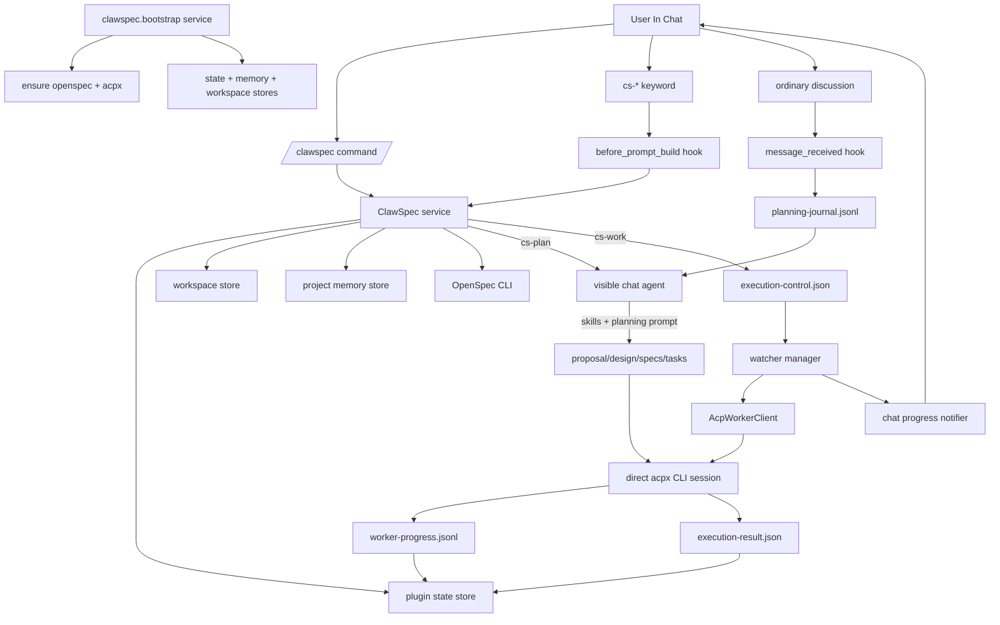
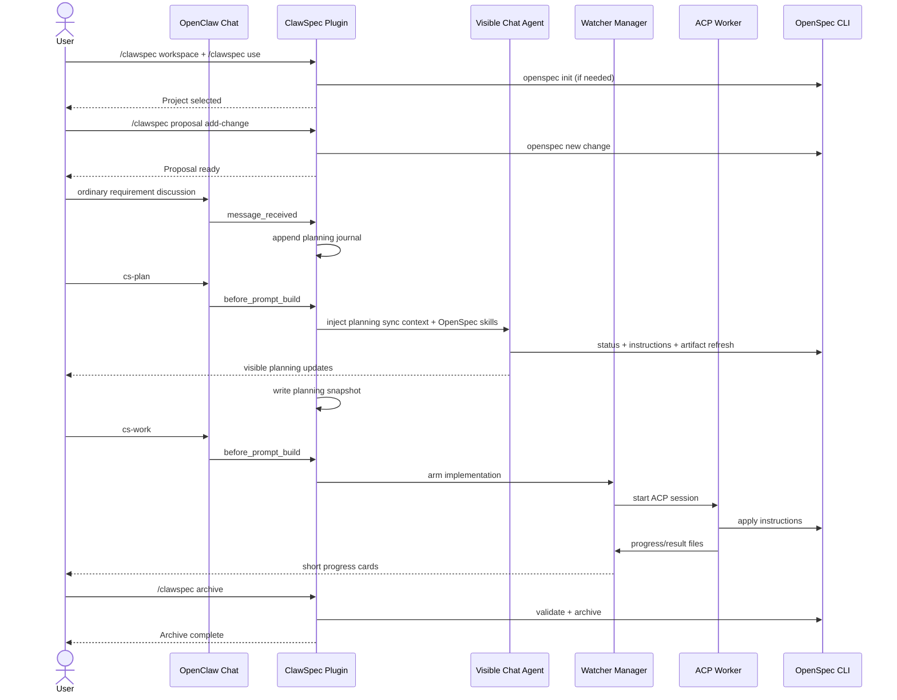
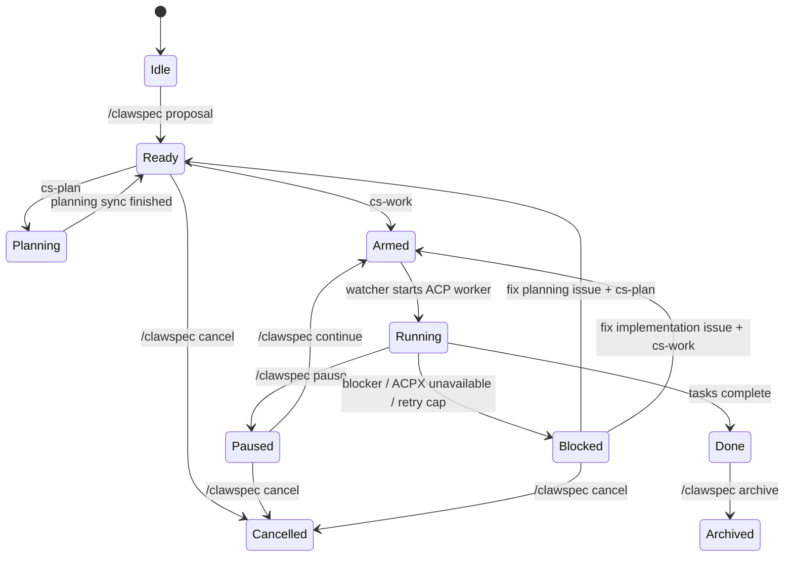

# ClawSpec

<p align="center">
  <a href="https://linux.do" target="_blank">
    
  </a>
</p>

[Chinese (Simplified)](./README.zh-CN.md)

ClawSpec is an OpenClaw plugin that embeds an OpenSpec workflow directly into chat. It splits project control and execution on purpose:

- `/clawspec ...` manages workspace, project, change, and recovery state.
- `cs-*` chat keywords trigger work inside the active conversation.
- `cs-plan` runs planning sync in the visible chat turn.
- `cs-work` runs implementation in the background through a watcher and ACP worker, then reports short progress updates back into chat.

The result is an OpenSpec workflow that stays chat-native without hiding long-running implementation work inside the main session.

## At A Glance

- Workspace is remembered per chat channel.
- One active project is tracked per chat channel.
- One unfinished change is enforced per repo across channels.
- Discussion messages are recorded into a planning journal while context is attached.
- `cs-plan` refreshes `proposal.md`, `design.md`, `specs`, and `tasks.md` without implementing code.
- `cs-work` turns `tasks.md` into background execution, with watcher-driven progress and restart handling.
- A running ACP worker can survive a gateway restart; ClawSpec will try to reattach to the live session before starting a replacement worker.
- `/clawspec cancel` restores tracked files from snapshots instead of doing a blanket Git reset.
- `/clawspec archive` validates and archives the finished OpenSpec change, then clears the active change from chat context.

## Why The Surface Is Split

ClawSpec uses two different control surfaces because they solve different problems:

| Surface | Examples | What it does | Why it exists |
| --- | --- | --- | --- |
| Slash command | `/clawspec use`, `/clawspec proposal`, `/clawspec status` | Direct plugin control, file system setup, state inspection | Fast, deterministic, no agent turn required |
| Chat keyword | `cs-plan`, `cs-work`, `cs-pause` | Injects workflow context into the current conversation or queues background execution | Keeps planning visible in chat and lets normal chat remain the primary UX |

In practice:

- Use `/clawspec ...` to set up and manage the project.
- Use `cs-plan` when you want the current visible agent turn to refresh planning artifacts.
- Use `cs-work` when you want the watcher to start background implementation.

## Architecture



## Current System Architecture

ClawSpec is split into six runtime layers.

| Layer | Main pieces | Responsibility |
| --- | --- | --- |
| Bootstrap | `clawspec.bootstrap`, `ensureOpenSpecCli`, `ensureAcpxCli` | Initializes stores, verifies dependencies, and starts the watcher manager |
| Control plane | `/clawspec` command, `clawspec-projects`, plugin hooks | Receives user intent, routes commands, and attaches the right chat context |
| Planning plane | `message_received`, `before_prompt_build`, visible main agent turn | Records requirement discussion and runs `cs-plan` directly in the visible chat |
| Execution plane | `WatcherManager`, `ExecutionWatcher`, `AcpWorkerClient` | Arms work, starts the background worker, and monitors progress/result files |
| Recovery plane | startup recovery, restart backoff, session adoption | Re-attaches to live workers after gateway restart or re-arms failed work safely |
| Persistence plane | OpenClaw state files + repo-local `.openclaw/clawspec` files | Stores project state, journals, progress, rollback baselines, and execution results |

Important architectural choices:

- Planning is visible. `cs-plan` runs in the main chat turn and does not use a hidden subagent.
- Implementation is durable. `cs-work` is handed off to a watcher-managed background worker.
- Worker transport is direct. ClawSpec talks to `acpx` through its own `AcpWorkerClient`, rather than depending on a hidden planning thread.
- Progress is file-backed. The worker writes progress and result files so the watcher can recover after gateway restarts.
- Repo safety is explicit. Cancel uses snapshot restore for tracked files instead of blanket repository reset.

## Implementation Strategy

### 1. Bootstrap and dependency discovery

When the plugin service starts, it:

- initializes the project, memory, and workspace stores
- ensures `openspec` is available from plugin-local install or `PATH`
- ensures `acpx` is available from plugin-local install, the OpenClaw builtin ACPX extension, or `PATH`
- constructs `OpenSpecClient`, `AcpWorkerClient`, `ClawSpecNotifier`, `WatcherManager`, and `ClawSpecService`

This means the plugin can bootstrap its own local toolchain on a fresh gateway host without requiring a manually prepared dev environment.

### 2. Command routing and prompt injection

ClawSpec uses three hook paths:

- `message_received` records planning discussion into the journal when the project is attached
- `before_prompt_build` injects project, planning, or execution context into the visible chat turn
- `agent_end` reconciles the end of visible planning turns

The `/clawspec` slash command is used for deterministic operations such as workspace selection, project selection, change creation, pause, continue, archive, and cancel.

### 3. Visible planning flow

Planning has two modes:

- ordinary attached discussion, which only records requirements
- `cs-plan`, which runs a deliberate planning sync in the visible chat

During `cs-plan`, ClawSpec injects:

- the active repo and change
- the planning journal
- imported OpenSpec skill text from `skills/`
- strict rules that prevent code implementation or silent change switching

The main chat agent then refreshes `proposal.md`, `specs`, `design.md`, and `tasks.md` in the current visible turn.

### 4. Background implementation flow

`cs-work` does not implement inside the visible chat turn. Instead it:

- verifies that planning is clean enough to execute
- writes `execution-control.json`
- arms the watcher for the active channel/project
- lets the watcher start a direct `acpx` session for the worker

The worker reads:

- repo-local control files
- planning artifacts
- `openspec instructions apply --json`

It then works task by task, updates `tasks.md`, writes `execution-result.json`, and appends compact structured events to `worker-progress.jsonl`.

### 5. Progress reporting and replay

The watcher is responsible for user-facing progress updates:

- it tails `worker-progress.jsonl`
- translates worker events into short chat updates
- keeps project task counts and heartbeat state in sync
- replays missed progress from the last saved offset before sending the final completion message
- reports startup milestones separately from task milestones, so "worker connected" and "loading context" can appear before the first task starts

You should now expect early implementation updates in two layers:

- watcher-level status such as "starting worker" and "ACP worker connected"
- worker-written status such as "Preparing <task>: loading context", "Loaded proposal.md", and "Context ready..."

That replay step is important because it prevents the user from missing late task updates if the gateway or watcher was temporarily behind.

### 6. Recovery, restart, and bounded retries

On gateway restart, the watcher manager:

- scans active projects
- adopts a still-running worker session if it is alive
- otherwise re-arms the project for planning or implementation
- preserves task progress and the worker progress offset

Automatic restart recovery is intentionally limited to projects that were actively armed, running, planning, or blocked by a recoverable ACP/runtime failure. A `ready` or `idle` project that is simply waiting for `cs-plan` or `cs-work` is not auto-started.

On worker failure, ClawSpec:

- distinguishes recoverable ACP failures from real blockers
- retries recoverable failures with bounded backoff
- stops retrying after the configured cap and marks the project as `blocked`

This keeps `cs-work` resilient without leaving silent zombie work behind.

## What Runs Where

| Action | Runtime | Visible to user | Writes |
| --- | --- | --- | --- |
| `/clawspec workspace` | Plugin command handler | Immediate command reply | Workspace state |
| `/clawspec use` | Plugin command handler + `openspec init` if needed | Immediate command reply | Workspace/project selection, OpenSpec init |
| `/clawspec proposal` | Plugin command handler + `openspec new change` | Immediate command reply | Change scaffold, snapshots, fresh planning state |
| Ordinary discussion | Main chat agent + prompt injection | Yes | Planning journal, no artifact rewrite |
| `cs-plan` | Main chat agent in the current visible turn | Yes | Planning artifacts, planning journal snapshot |
| `cs-work` | Watcher + ACP worker | Progress updates only | Code changes, `tasks.md`, watcher support files |
| `/clawspec continue` | Plugin decides whether to re-arm planning or implementation | Immediate reply, then either visible planning or background work | Execution state |

## Requirements

- A recent OpenClaw build with plugin hooks and ACP runtime support.
- Node.js `>= 24` on the gateway host.
- `npm` available on the gateway host if OpenSpec must be bootstrapped automatically.
- An OpenClaw agent profile that can run shell commands and edit files for visible planning turns.
- ACP backend `acpx` enabled for background implementation.

ClawSpec depends on these OpenClaw hook points:

- `message_received`
- `before_prompt_build`
- `agent_end`

If your host disables plugin hooks globally, keyword-based workflow will not work correctly.

## Installation

### 1. Install the plugin

You can install ClawSpec in three common ways:

Option A: OpenClaw plugin installer (recommended)

```powershell
openclaw plugins install clawspec@latest
```

Option B: ClawHub CLI installer

```powershell
npx clawhub@latest install clawspec
```

Option C: npm package tarball (manual fallback)

```powershell
$pkg = npm pack clawspec@latest
openclaw plugins install $pkg
```

`@latest` always resolves to the newest published ClawSpec release on npm.

If you want an unreleased commit before npm publish, clone the repository and install from the local checkout or a downloaded `.tgz` archive instead.

### 2. Enable ACP in OpenClaw

Example `~/.openclaw/openclaw.json`:

```json
{
  "acp": {
    "enabled": true,
    "backend": "acpx",
    "defaultAgent": "codex"
  },
  "plugins": {
    "entries": {
      "clawspec": {
        "enabled": true,
        "config": {
          "defaultWorkspace": "~/clawspec/workspace",
          "openSpecTimeoutMs": 120000,
          "watcherPollIntervalMs": 4000
        }
      }
    }
  }
}
```

Important notes:

- Recent OpenClaw builds often bundle `acpx` under the host install. ClawSpec checks that builtin copy before falling back to `acpx` on `PATH` or a plugin-local install.
- If your OpenClaw build does not bundle `acpx`, ClawSpec can fall back to a plugin-local install automatically.
- ClawSpec manages the `acpx` command path itself. You do not need to hardcode `plugins.entries.acpx.config.command`.
- `acp.defaultAgent` is now the global default used by ClawSpec background workers.
- `/clawspec worker <agent-id>` is still available as an explicit channel/project override.
- When ACP setup is incomplete, ClawSpec now shows ready-to-run commands such as `openclaw config set acp.backend acpx` and `openclaw config set acp.defaultAgent codex`.

### 2.5. Choose the default worker agent

ClawSpec can run background work with different ACP agents such as `codex` or `claude`.
There is now one global default source plus an optional per-channel override:

- `acp.defaultAgent`: the OpenClaw ACP default used by ClawSpec workers
- `/clawspec worker <agent-id>`: an explicit override persisted for the current channel/project context

Recommended global setup:

```json
{
  "acp": {
    "enabled": true,
    "backend": "acpx",
    "defaultAgent": "claude"
  }
}
```

Useful runtime commands:

- `/clawspec worker` shows the current worker agent for this channel/project and the configured default
- `/clawspec worker codex` switches the current channel/project to `codex`
- `/clawspec worker claude` switches the current channel/project to `claude`
- `/clawspec worker status` shows the live worker state, runtime transport state, startup phase, startup wait, and current session info

Notes:

- `/clawspec worker <agent-id>` is persisted at the current channel/project scope
- the chosen agent must exist in your OpenClaw agent list or ACP allowlist
- if you want a global default, set `acp.defaultAgent` in OpenClaw config
- if you want a one-off override for the active project conversation, use `/clawspec worker <agent-id>`

### 2.6. ClawSpec plugin config reference

Common `plugins.entries.clawspec.config` fields:

| Key | Purpose | Notes |
| --- | --- | --- |
| `defaultWorkspace` | Default base directory used by `/clawspec workspace` and `/clawspec use` | Channel-specific workspace selection overrides this after first use |
| `openSpecTimeoutMs` | Timeout for each OpenSpec CLI invocation | Increase this if your repo or host is slow |
| `watcherPollIntervalMs` | Background watcher recovery poll interval | Controls how quickly recovery scans and replay checks run |
| `archiveDirName` | Directory name under `.openclaw/clawspec/` for archived bundles | Keep the default unless you need a different archive layout |
| `allowedChannels` | Optional allowlist of channel ids allowed to use ClawSpec | Useful when only selected channels should expose the workflow |

Backward-compatibility keys still accepted but currently treated as no-ops:

- `maxAutoContinueTurns`
- `maxNoProgressTurns`
- `workerAgentId`
- `workerBackendId`
- `workerWaitTimeoutMs`
- `subagentLane`

### 3. Restart the gateway

```powershell
openclaw gateway restart
openclaw gateway status
```

### 4. Understand tool bootstrap behavior

On startup ClawSpec checks for `openspec` in this order:

1. Plugin-local binary under `node_modules/.bin`
2. `openspec` on `PATH`
3. If missing, it may run:

```powershell
npm install --omit=dev --no-save @fission-ai/openspec
```

That means the gateway host may need network access and a working `npm` if `openspec` is not already available.

On startup ClawSpec checks for `acpx` in this order:

1. Plugin-local binary under `node_modules/.bin`
2. The ACPX binary bundled with the current OpenClaw install
3. `acpx` on `PATH`
4. If none of those satisfy the worker runtime requirement, it may run:

```powershell
npm install --omit=dev --no-save acpx@0.3.1
```

That fallback install can take a while on the first run. If OpenClaw already bundles ACPX, ClawSpec should now reuse it instead of reinstalling another copy.

### 4.5. CI and release automation

This repository now includes two GitHub Actions workflows:

- `.github/workflows/ci.yml`
  Runs on `push` to `main`, `pull_request`, and manual dispatch.
  Uses a three-platform matrix: `ubuntu-latest`, `windows-latest`, `macos-latest`.
  Runs `npm ci`, `npm run check`, and `npm test`.
- `.github/workflows/release.yml`
  Runs on tag pushes that match `v*`.
  Verifies the tag matches `package.json` version, runs install/check/test/pack, publishes to npm, then creates a GitHub Release.

Release notes:

- The release workflow expects tags in the form `vX.Y.Z`.
- The tag must match the `package.json` version exactly.
- npm publishing requires either npm trusted publishing or an `NPM_TOKEN` repository secret.
- GitHub Release creation uses the default GitHub Actions token and does not require an extra manual token.

Typical release flow:

```powershell
# 1. bump package.json version
git add package.json package-lock.json
git commit -m "chore: release vX.Y.Z"
git push origin main

# 2. create and push a matching tag
git tag vX.Y.Z
git push origin vX.Y.Z
```

## Quick Start

```text
/clawspec workspace "<workspace-path>"
/clawspec use "demo-app"
/clawspec proposal add-login-flow "Build login and session handling"
Describe the requirement in chat
cs-plan
cs-work
/clawspec status
/clawspec archive
```

What happens:

1. `/clawspec workspace` selects the workspace for this chat channel.
2. `/clawspec use` selects or creates a repo folder under that workspace and runs `openspec init` if needed.
3. `/clawspec proposal` creates the OpenSpec change scaffold and snapshot baseline.
4. Ordinary chat discussion appends requirement notes to the planning journal.
5. `cs-plan` refreshes planning artifacts in the visible chat turn.
6. `cs-work` arms the watcher and starts background implementation.
7. Watcher progress updates appear back in the same chat.
8. `/clawspec archive` validates and archives the completed change.

## Recommended First Run

This is the normal happy-path flow for a first-time user.

### 1. Bind a workspace and select a project

```text
/clawspec workspace "D:\clawspec\workspace"
/clawspec use "demo-app"
```

Expected result:

- ClawSpec remembers the workspace for the current chat channel.
- The project directory is created if it does not exist.
- `openspec init` runs automatically the first time a repo is selected.

### 2. Create a change before discussing requirements

```text
/clawspec proposal add-login-flow "Build login and session handling"
```

Expected result:

- OpenSpec creates `openspec/changes/add-login-flow/`
- ClawSpec takes a rollback snapshot baseline
- The chat enters the active change context for `add-login-flow`

### 3. Describe the requirement in normal chat

Example:

```text
Use email + password login.
Add refresh token support.
Expire access tokens after 15 minutes.
```

Expected result:

- Your discussion is appended to the planning journal while the chat is attached.
- ClawSpec does not rewrite artifacts yet.
- ClawSpec does not start coding yet.

### 4. Run visible planning sync

```text
cs-plan
```

Expected result:

- The current visible chat turn refreshes `proposal.md`, `design.md`, `specs`, and `tasks.md`
- You should see planning progress in the main chat
- The final message should clearly tell you to run `cs-work`

### 5. Start background implementation

```text
cs-work
```

Expected result:

- ClawSpec arms the watcher
- The watcher starts the ACP worker through `acpx`
- Short progress updates begin to appear in chat as tasks start and finish

### 6. Check progress or temporarily leave project mode

Useful commands:

```text
/clawspec worker status
/clawspec status
cs-detach
cs-attach
```

Use `cs-detach` when you want to keep the worker running but stop normal chat from being recorded into the planning journal. Use `cs-attach` when you want to continue discussing this change.

### 7. Finish the change

If implementation completes cleanly:

```text
/clawspec archive
```

If you want to add more requirements before archive:

```text
Describe the new requirement in chat
cs-plan
cs-work
```

That loop is the normal operating model:

1. discuss
2. `cs-plan`
3. `cs-work`
4. archive when done

## Slash Commands

| Command | When to use | What it does |
| --- | --- | --- |
| `/clawspec workspace [path]` | Before selecting a project, or when switching to another base workspace | Shows the current workspace for this chat channel, or updates it when a path is provided |
| `/clawspec use <project-name>` | When starting or resuming work in a repo | Selects or creates the project directory under the current workspace and runs `openspec init` if needed |
| `/clawspec proposal <change-name> [description]` | Before structured planning starts | Creates the OpenSpec change scaffold, prepares rollback state, and makes that change active |
| `/clawspec worker` | When you want to inspect the current worker agent selection | Shows the current per-channel/project worker agent and the plugin default |
| `/clawspec worker <agent-id>` | When you want this project conversation to use another ACP worker, such as `codex` or `claude` | Overrides the worker agent for the current channel/project context |
| `/clawspec worker status` | During background work or recovery debugging | Shows configured worker agent, runtime transport state, startup phase, startup wait, live session state, pid, heartbeat, and next action |
| `/clawspec attach` | When ordinary chat should go back to recording requirements for the active change | Reattaches the current conversation to ClawSpec context so planning notes are journaled again |
| `/clawspec detach` | When background work should continue but ordinary chat should stop affecting the project | Detaches ordinary chat from ClawSpec prompt injection and planning journal capture |
| `/clawspec deattach` | Only for backward compatibility with older habits | Legacy alias for `/clawspec detach` |
| `/clawspec continue` | After a pause, blocker resolution, or restart recovery | Resumes planning or implementation based on the current project phase |
| `/clawspec pause` | When you want the worker to stop at a safe boundary | Requests a cooperative pause for the current execution |
| `/clawspec status` | Any time you want a reconciled project snapshot | Renders current workspace, project, change, lifecycle, task counts, journal status, and next step |
| `/clawspec archive` | After all tasks are complete and you want to close the change | Validates and archives the finished OpenSpec change, then clears active change state |
| `/clawspec cancel` | When you want to abandon the active change | Restores tracked files from snapshots, removes the change, stops execution state, and clears the active change |
| `/clawspec doctor` | When something isn't working as expected | Runs automated diagnostics on your environment and configuration, reports detected issues with suggested fixes |
| `/clawspec doctor fix` | After `/clawspec doctor` reports a fixable issue | Automatically applies safe fixes for all detected issues that support auto-repair |

Auxiliary host CLI:

| Command | When to use | What it does |
| --- | --- | --- |
| `clawspec-projects` | On the gateway host when you want to inspect saved workspace roots | Lists remembered ClawSpec workspaces from plugin state |

## Chat Keywords

Send these as normal chat messages in the active conversation.

| Keyword | Purpose |
| --- | --- |
| `cs-plan` | Runs visible planning sync in the current chat turn. Use this after you discuss or change requirements. |
| `cs-work` | Starts background implementation for pending tasks. Use this only after planning is clean. |
| `cs-attach` | Reattaches ordinary chat to project mode so requirement discussion is journaled again. |
| `cs-detach` | Detaches ordinary chat from project mode while letting watcher updates continue. |
| `cs-deattach` | Legacy alias for `cs-detach`. |
| `cs-pause` | Requests a cooperative pause for the background worker. |
| `cs-continue` | Resumes planning or implementation, depending on the current blocked or paused state. |
| `cs-status` | Shows current project status in chat. |
| `cs-cancel` | Cancels the active change from chat without using the slash command. |

## End-To-End Workflow



## Attached vs Detached Chat

ClawSpec keeps a `contextMode` per chat channel:

| Mode | Effect |
| --- | --- |
| `attached` | Ordinary chat gets ClawSpec prompt injection and planning messages are journaled |
| `detached` | Ordinary chat behaves normally; background watcher updates can still appear |

Use detached mode when you want background implementation to keep running but you do not want normal conversation to pollute the planning journal.

## Planning Journal And Dirty State

ClawSpec keeps a repo-local planning journal at:

```text
<repo>/.openclaw/clawspec/planning-journal.jsonl
```

Journal behavior:

- User requirement messages are appended while the active change is attached.
- Substantive assistant replies can also be appended.
- Passive workflow control messages are filtered out.
- Commands and `cs-*` keywords are not journaled as planning content.
- A planning snapshot is written after successful `cs-plan`.
- If new discussion arrives after the last snapshot, the journal becomes `dirty`.

This is why `cs-work` may refuse to start and ask for `cs-plan` first: the implementation should not run against stale planning artifacts.

## Visible Planning

`cs-plan` does not use the background ACP worker. It runs in the current visible chat turn by injecting:

- the active change context
- the planning journal
- imported OpenSpec skill text from the bundled `skills/` directory

Imported skill mapping:

| Mode | Skills |
| --- | --- |
| Ordinary planning discussion | `openspec-explore`, `openspec-propose` |
| `cs-plan` planning sync | `openspec-explore`, `openspec-propose` |
| `cs-work` implementation | `openspec-apply-change` |

Planning prompt guardrails intentionally prevent the main chat agent from:

- starting planning sync without an explicit `cs-plan`
- implementing code during ordinary planning discussion
- switching to another OpenSpec change silently
- scanning sibling change directories unnecessarily

## Background Implementation

`cs-work` does three things:

1. Runs `openspec status` and `openspec instructions apply --json`
2. Writes `execution-control.json` and arms the watcher
3. Lets the watcher start an ACP worker session through `acpx`

The watcher then:

- posts a short startup message
- posts a short `"ACP worker connected"` message
- streams progress from `worker-progress.jsonl`
- reconciles `execution-result.json`
- replays missed progress before the final completion message if the watcher had fallen behind
- updates project state
- restarts recoverable ACP failures with bounded backoff
- surfaces ACPX availability problems in a short actionable format

## Recovery And Restart Model

ClawSpec is designed so background work is recoverable:

- gateway start: watcher manager scans active projects and first tries to adopt any still-running ACP worker session
- adopted live session: if the worker is still alive, ClawSpec keeps the existing ACP session, resumes watching its progress files, and does not require you to rerun `cs-work`
- dead session on restart: if the old worker is gone, ClawSpec re-arms recoverable work and starts a replacement worker when needed
- gateway stop: active background sessions are closed and resumable state is preserved
- ACP worker crash: watcher retries recoverable failures with backoff
- max restart cap: after 10 ACP restart attempts, the project becomes `blocked`

This makes `cs-work` much more resilient than trying to keep the entire implementation inside a single visible chat turn.

## Lifecycle Model

The real implementation tracks both `status` and `phase`. The simplified diagram below is the easiest way to reason about it:



## Files And Storage

Global OpenClaw plugin state:

```text
<openclaw-state-dir>/clawspec/
  active-projects.json
  project-memory.json
  workspace-state.json
  projects/
    <projectId>.json
```

Repo-local runtime state:

```text
<repo>/.openclaw/clawspec/
  state.json
  execution-control.json
  execution-result.json
  worker-progress.jsonl
  progress.md
  changed-files.md
  decision-log.md
  latest-summary.md
  planning-journal.jsonl
  planning-journal.snapshot.json
  rollback-manifest.json
  snapshots/
    <change-name>/
      baseline/
  archives/
    <projectId>/
```

OpenSpec change artifacts still live in the normal OpenSpec location:

```text
<repo>/openspec/changes/<change-name>/
  .openspec.yaml
  proposal.md
  design.md
  tasks.md
  specs/
```

## Operational Boundaries

- Workspace is remembered per chat channel.
- One active project is tracked per chat channel.
- One unfinished change is enforced per repo across channels.
- `tasks.md` remains the task source of truth.
- OpenSpec remains the canonical source for workflow semantics.
- ClawSpec never does a blanket `git reset --hard` during cancel.
- Detached mode stops prompt injection and journaling, but not watcher notifications.

## Troubleshooting

### `cs-work` says planning is required

Cause:

- planning journal is dirty
- planning artifacts are missing or stale
- OpenSpec apply state is still blocked

What to do:

1. keep discussing requirements if needed
2. run `cs-plan`
3. run `cs-work` again

### Worker looks connected but has not started the task yet

This usually means the ACP worker is already alive and is still digesting the implementation prompt or reading planning artifacts.

What to check:

1. watcher messages such as "ACP worker connected..."
2. worker-written status messages such as "Preparing <task>: loading context"
3. `/clawspec worker status`, especially `startup phase` and `startup wait`

If you already see "Context ready for ..." then the worker has finished loading planning artifacts and is about to move into implementation. That phase can still take a little time before the first `task_start`.

### Watcher says ACPX is unavailable

Cause:

- `acp.enabled` is false
- `acp.backend` is not `acpx`
- `acp.defaultAgent` is missing
- your OpenClaw build does not bundle `acpx` and ClawSpec could not find or install a usable copy

What to do:

1. run `openclaw config set acp.backend acpx`
2. run `openclaw config set acp.defaultAgent codex`
3. if your host does not bundle ACPX, let ClawSpec install a plugin-local copy or install `acpx` manually
4. rerun `cs-work` or `/clawspec continue`

### Ordinary chat is polluting the planning journal

Use:

```text
cs-detach
```

or:

```text
/clawspec detach
```

Then reattach later with `cs-attach` or `/clawspec attach`.

### `/clawspec use` says there is already an unfinished change

That is expected. ClawSpec prevents you from silently orphaning an active change in the same repo.

Use one of:

- `/clawspec continue`
- `/clawspec cancel`
- `/clawspec archive`

### Cancel did not revert the whole repo

That is by design. Cancel restores tracked files from the ClawSpec snapshot baseline for the active change. It is intentionally narrower than a blanket Git restore.

### Worker fails with "stdin is not a terminal" or session creation returns no result

Cause:

- `~/.acpx/config.json` has a custom agent entry (e.g. `agents.codex` pointing to a local CLI binary)
- acpx cannot spawn the agent in a non-interactive environment when it is configured as a raw CLI command

What to do:

1. Run `/clawspec doctor` to check for known configuration issues.
2. If `/clawspec doctor` reports custom agent entries, run `/clawspec doctor fix` to clear them automatically.
3. Alternatively, edit `~/.acpx/config.json` manually and set `"agents": {}`.
4. Retry `cs-work` or `/clawspec continue`.

## Development And Validation

Useful checks while editing the plugin:

```powershell
node --experimental-strip-types -e "import('./src/index.ts')"
node --experimental-strip-types --test test/watcher-work.test.ts
```

Useful manual validation flow:

```text
/clawspec workspace "<workspace-path>"
/clawspec use "demo-app"
/clawspec proposal add-something "Build something"
Discuss requirements in chat
cs-plan
cs-work
cs-status
/clawspec worker status
/clawspec pause
/clawspec continue
/clawspec archive
```

Typical values for `<workspace-path>`:

- macOS: `~/clawspec/workspace`
- Linux: `~/clawspec/workspace`
- Windows: `D:\clawspec\workspace`

## Implementation Summary

ClawSpec is intentionally not "just more prompts." It is a small orchestration layer that combines:

- OpenClaw hooks for visible chat control
- OpenSpec CLI for canonical workflow semantics
- a planning journal and snapshots for change tracking
- a watcher manager for durable background work
- ACP worker execution for long-running implementation

That split is the reason the plugin can keep planning conversational while still making implementation durable and resumable.
