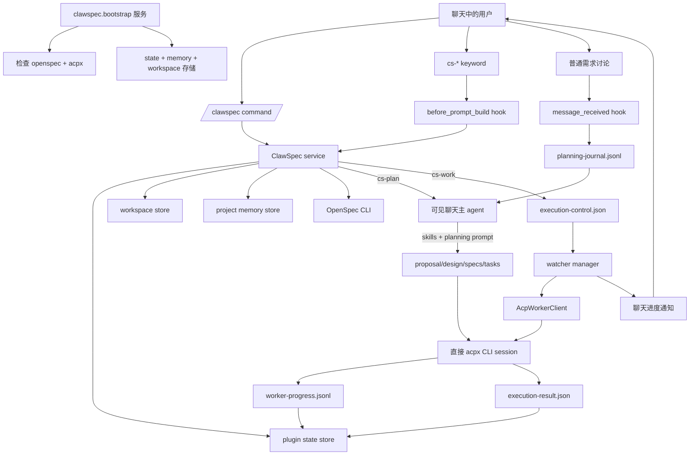
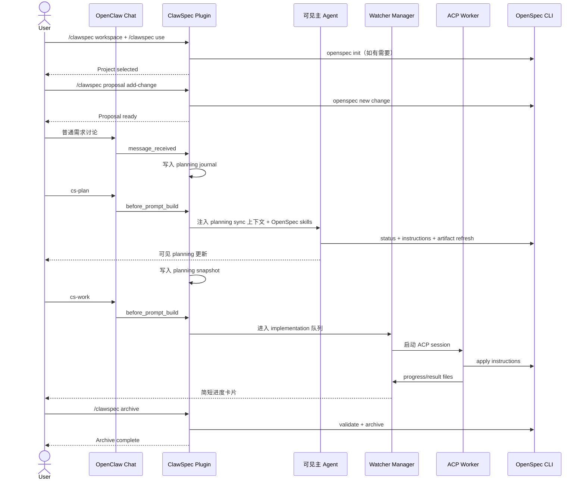
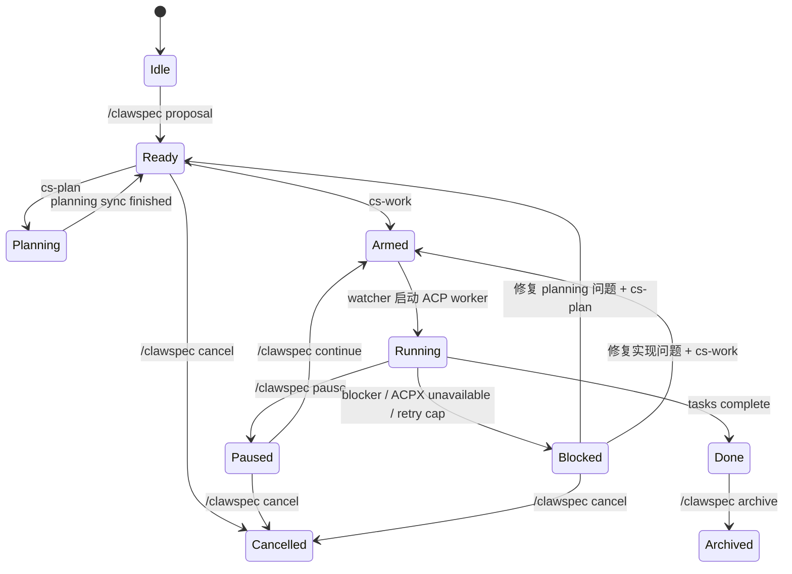

# ClawSpec

[English](./README.md)

ClawSpec 是一个把 OpenSpec 工作流嵌入 OpenClaw 聊天窗口的插件。它有意把“项目控制”和“执行触发”分成两层：

- `/clawspec ...` 负责 workspace、project、change、恢复状态等直接控制。
- `cs-*` 关键字负责在当前聊天里触发工作。
- `cs-plan` 在当前可见聊天回合里执行 planning sync。
- `cs-work` 通过 watcher + ACP worker 在后台执行实现，并把简短进度消息回推到聊天窗口。

这样做的目的，是让 OpenSpec 既保持聊天式体验，又不会把长时间实现任务硬塞进主聊天回合里。

## 一眼看懂

- workspace 按 chat channel 记忆，不是全局只有一个。
- 每个 chat channel 只维护一个活动 project。
- 同一个 repo 在所有 channel 中只允许存在一个未完成 change。
- 在 attached 状态下，需求讨论会写入 planning journal。
- `cs-plan` 只刷新 `proposal.md`、`design.md`、`specs`、`tasks.md`，不写业务代码。
- `cs-work` 会把 `tasks.md` 变成后台执行任务，并由 watcher 负责推进度和恢复。
- 如果 ACP worker 在 gateway 重启后仍然存活，ClawSpec 会优先接管这条现有 session，而不是盲目再起一个新 worker。
- `/clawspec cancel` 通过快照回滚变更，不会做整仓库 Git reset。
- `/clawspec archive` 在任务完成后归档 OpenSpec change，并清掉当前聊天里的活动 change。

## 为什么命令面要拆开

ClawSpec 使用两套入口，是因为它们解决的是两类完全不同的问题：

| 入口 | 示例 | 负责什么 | 为什么需要它 |
| --- | --- | --- | --- |
| Slash command | `/clawspec use`、`/clawspec proposal`、`/clawspec status` | 直接插件控制、目录初始化、状态查询 | 快、确定性强，不依赖 agent 回合 |
| 聊天关键字 | `cs-plan`、`cs-work`、`cs-pause` | 在当前聊天里注入工作流上下文，或排队后台执行 | 让 planning 可见、让实现可恢复 |

实际使用时：

- 用 `/clawspec ...` 管项目和状态。
- 用 `cs-plan` 让当前可见聊天回合去刷新 planning artifacts。
- 用 `cs-work` 让 watcher 启动后台实现。

## 架构图



## 当前系统架构

ClawSpec 现在可以按六层来理解：

| 层级 | 主要组件 | 职责 |
| --- | --- | --- |
| 启动层 | `clawspec.bootstrap`、`ensureOpenSpecCli`、`ensureAcpxCli` | 初始化存储、检查依赖、启动 watcher manager |
| 控制层 | `/clawspec` 命令、`clawspec-projects`、插件 hooks | 接收用户意图、路由命令、决定当前聊天要注入什么上下文 |
| Planning 层 | `message_received`、`before_prompt_build`、主聊天 agent | 记录需求讨论，并在 `cs-plan` 时直接在主聊天窗口完成 planning sync |
| 执行层 | `WatcherManager`、`ExecutionWatcher`、`AcpWorkerClient` | arm 任务、启动后台 worker、监控 progress/result 文件 |
| 恢复层 | 启动恢复、重试退避、session 接管 | gateway 重启后接管存活 worker，或安全地重排任务 |
| 持久化层 | OpenClaw 全局状态 + repo 内 `.openclaw/clawspec` | 保存项目状态、journal、回滚快照、执行结果、进度偏移量 |

当前架构里有几个关键取舍：

- Planning 是可见的。`cs-plan` 在主聊天窗口执行，不走隐藏 subagent。
- Implementation 是耐久的。`cs-work` 交给 watcher 管理的后台 worker。
- Worker 通道是直接的。ClawSpec 通过自己的 `AcpWorkerClient` 直接调用 `acpx`，而不是依赖隐藏 planning thread。
- 进度是文件化的。worker 把进度和结果写到文件里，这样 watcher 和 gateway 重启后都能恢复。
- 回滚是显式的。`cancel` 走快照恢复，不做整仓库粗暴重置。

## 实现方案

### 1. 启动与依赖自检

插件服务启动时会做这几件事：

- 初始化 project、memory、workspace 三套 store
- 检查 `openspec` 是否可用，优先本地安装，其次系统 `PATH`
- 检查 `acpx` 是否可用，优先插件本地安装，其次 OpenClaw 自带的 ACPX，最后才是系统 `PATH`
- 构造 `OpenSpecClient`、`AcpWorkerClient`、`ClawSpecNotifier`、`WatcherManager`、`ClawSpecService`

这意味着在一台比较“干净”的 gateway 主机上，ClawSpec 也能把自己依赖的工具链引导起来。

### 2. 命令路由与 prompt 注入

ClawSpec 主要用三条 hook 链路：

- `message_received`：在 attached 状态下把需求讨论写入 planning journal
- `before_prompt_build`：决定当前可见聊天回合要注入 project / planning / execution 哪类上下文
- `agent_end`：对齐一次可见 planning 回合的结束状态

而 `/clawspec` 斜杠命令负责确定性更强的操作，例如：

- 切 workspace
- 选 project
- 新建 change
- pause / continue
- archive / cancel

### 3. 可见 planning 流程

Planning 分两种模式：

- 普通 attached 需求讨论：只记录，不改 artifacts
- `cs-plan`：显式触发 planning sync，在主聊天窗口里执行

在 `cs-plan` 时，ClawSpec 会向主聊天 agent 注入：

- 当前 active repo 和 active change
- planning journal
- `skills/` 目录里的 OpenSpec skill 文本
- 一套严格规则，防止它静默切换 change 或直接开始写业务代码

随后主聊天 agent 会在当前可见回合里刷新 `proposal.md`、`specs`、`design.md`、`tasks.md`。

### 4. 后台 implementation 流程

`cs-work` 不会在主聊天窗口里直接实现代码，而是按这条链路走：

- 先确认 planning 状态足够干净，可以开始执行
- 写入 `execution-control.json`
- 给当前 channel/project arm watcher
- watcher 再启动一个直接的 `acpx` worker session

worker 会读取：

- repo 内的控制文件
- planning artifacts
- `openspec instructions apply --json`

然后按 task 顺序逐个执行、更新 `tasks.md`、写 `execution-result.json`，并把结构化进度事件追加到 `worker-progress.jsonl`。

### 5. 进度播报与漏发补偿

面向用户的进度回报由 watcher 负责：

- 持续读取 `worker-progress.jsonl`
- 把 worker 事件转换成简短聊天消息
- 同步 project task counts 和 heartbeat
- 在最终完成消息发出前，根据上次保存的 offset 把漏掉的进度补发出来

现在实现启动期的可见性被拆成了两层：

- watcher 侧状态，例如“starting worker”“ACP worker connected”
- worker 自己写出的上下文加载状态，例如“Preparing <task>: loading context”“Loaded proposal.md”“Context ready...”

最后这一点很重要，因为它能避免 gateway 或 watcher 短暂落后时，用户错过最后几条任务更新。

### 6. 恢复、重启与有界重试

gateway 重启后，watcher manager 会：

- 扫描所有活动项目
- 如果发现旧 worker session 还活着，就直接接管
- 如果 session 已经死掉，就把项目重新 arm 到 planning 或 implementation
- 保留 task 进度和 worker progress offset

自动恢复只会针对“原本就在执行链路中”的项目：例如 `armed`、`running`、`planning`，或者被可恢复 ACP/runtime 故障打断的 `blocked` 项目。单纯处于 `ready` / `idle`、只是等你手动说 `cs-plan` 或 `cs-work` 的项目，不会在 gateway 重启后自动开跑。

worker 失败时，ClawSpec 会：

- 区分“可恢复的 ACP 故障”和“真实 blocker”
- 对可恢复故障做有限次数、带退避的重试
- 超过上限后把项目标记为 `blocked`

这样 `cs-work` 才能既有恢复能力，又不会在后台无休止地留下僵尸任务。

## 各动作到底跑在哪

| 动作 | 运行位置 | 用户是否可见 | 会写什么 |
| --- | --- | --- | --- |
| `/clawspec workspace` | 插件命令处理器 | 直接回复 | Workspace 状态 |
| `/clawspec use` | 插件命令处理器，必要时跑 `openspec init` | 直接回复 | Project 选择、OpenSpec 初始化 |
| `/clawspec proposal` | 插件命令处理器，跑 `openspec new change` | 直接回复 | Change 脚手架、快照基线、planning 初始状态 |
| 普通需求讨论 | 主聊天 agent + prompt 注入 | 可见 | Planning journal，不改 artifact |
| `cs-plan` | 当前可见聊天回合 | 可见 | Planning artifacts、journal snapshot |
| `cs-work` | Watcher + ACP worker | 只看到简短进度回报 | 代码、`tasks.md`、runtime 支持文件 |
| `/clawspec continue` | 插件根据当前 phase 决定恢复 planning 还是 work | 直接回复，之后进入相应流程 | Execution 状态 |

## 环境要求

- 一份较新的 OpenClaw，支持插件 hooks 和 ACP runtime。
- Gateway 主机上有 Node.js `>= 24`。
- 如果需要自动安装 OpenSpec，则主机上还需要 `npm`。
- 用于可见 planning 的 agent 需要具备 shell 和文件编辑能力。
- 后台实现依赖 ACP backend `acpx`。

ClawSpec 依赖这几个 OpenClaw hook：

- `message_received`
- `before_prompt_build`
- `agent_end`

如果宿主全局禁用了插件 hooks，那么基于关键字的工作流就跑不起来。

## 安装

### 1. 安装插件

本地联动安装示例：

```powershell
openclaw plugins install clawspec@0.1.0
```

以后如果你把 ClawSpec 打包发布，也可以按普通 OpenClaw 插件的方式安装。下面的说明默认插件已经被 OpenClaw 发现。

### 2. 在 OpenClaw 里启用 ACP 和 ACPX

示例 `~/.openclaw/openclaw.json`：

```json
{
  "acp": {
    "enabled": true,
    "backend": "acpx",
    "defaultAgent": "codex"
  },
  "plugins": {
    "entries": {
      "acpx": {
        "enabled": true,
        "config": {
          "permissionMode": "approve-all",
          "expectedVersion": "any"
        }
      },
      "clawspec": {
        "enabled": true,
        "config": {
          "defaultWorkspace": "~/clawspec/workspace",
          "workerAgentId": "codex",
          "openSpecTimeoutMs": 120000,
          "watcherPollIntervalMs": 4000
        }
      }
    }
  }
}
```

这里要注意：

- 新版 OpenClaw 往往已经自带 `acpx`，ClawSpec 现在会先检查这份 builtin ACPX，再回退到系统 `PATH` 或插件本地安装。
- 如果你的 OpenClaw 没有自带 `acpx`，那就要先单独安装或加载 `acpx`。
- ClawSpec 自己不携带 ACP runtime backend。
- 当 ACPX 不可用时，watcher 会在聊天里发一条简短提示，告诉用户去启用 `plugins.entries.acpx` 和 backend `acpx`。
- `acp.defaultAgent` 是 OpenClaw 自己的 ACP 默认 agent；ClawSpec 的后台 worker 默认看的是 `plugins.entries.clawspec.config.workerAgentId`。
- 对 ClawSpec 来说，worker 选择优先级是：当前 channel/project 上的 `/clawspec worker <agent-id>` 覆盖，其次是 `clawspec.config.workerAgentId`，最后才是 ClawSpec 自己的内置默认值。
- 也就是说，ClawSpec 现在不会自动继承 `acp.defaultAgent`。如果你希望两边都用同一个 agent，需要把两处都显式配成一样。

### 2.5. 选择默认 worker agent

ClawSpec 可以让后台任务跑在不同的 ACP agent 上，比如 `codex` 或 `claude`，但这里有两个“默认值”要区分：

- `acp.defaultAgent`：OpenClaw 自己 ACP 系统的默认 agent
- `plugins.entries.clawspec.config.workerAgentId`：ClawSpec 执行 `cs-work` 时使用的默认 worker agent

如果你希望两层都统一成同一个 agent，建议同时这样配置：

```json
{
  "acp": {
    "enabled": true,
    "backend": "acpx",
    "defaultAgent": "claude"
  },
  "plugins": {
    "entries": {
      "clawspec": {
        "enabled": true,
        "config": {
          "workerAgentId": "claude"
        }
      }
    }
  }
}
```

运行时常用命令：

- `/clawspec worker`：查看当前 channel/project 的 worker agent 以及插件默认值
- `/clawspec worker codex`：把当前 channel/project 切到 `codex`
- `/clawspec worker claude`：把当前 channel/project 切到 `claude`
- `/clawspec worker status`：查看实时 worker 状态、传输层状态、startup phase、startup wait 和 session 信息

补充说明：

- `/clawspec worker <agent-id>` 的覆盖范围是当前 channel/project
- 你填写的 agent id 必须已经存在于 OpenClaw 的 agent 列表或 ACP allowlist 中
- 如果你想配置“全局默认”，改的是 `clawspec.config.workerAgentId`
- 如果你想临时对当前项目改用另一个 agent，就直接执行 `/clawspec worker <agent-id>`

### 2.6. ClawSpec 插件配置项参考

常用的 `plugins.entries.clawspec.config` 字段如下：

| Key | 用途 | 说明 |
| --- | --- | --- |
| `defaultWorkspace` | `/clawspec workspace` 和 `/clawspec use` 的默认 workspace | 某个 channel 第一次选定 workspace 后，会优先使用该 channel 自己记住的值 |
| `workerAgentId` | 后台 worker 默认使用的 ACP agent | 可以被 `/clawspec worker <agent-id>` 在当前 channel/project 覆盖 |
| `workerBackendId` | 后台 worker session 的可选 ACP backend 覆盖 | 使用标准 `acpx` 时通常不需要设置 |
| `openSpecTimeoutMs` | 每次 OpenSpec CLI 调用的超时时间 | repo 较大或主机较慢时可以调大 |
| `watcherPollIntervalMs` | watcher 的后台恢复扫描周期 | 影响恢复检查和进度补发的灵敏度 |
| `archiveDirName` | `.openclaw/clawspec/` 下归档目录名称 | 除非你要调整归档布局，否则保持默认即可 |
| `allowedChannels` | 可选的 channel allowlist | 只想在部分频道启用 ClawSpec 时很有用 |

为了兼容旧配置，下面这些字段目前仍然接受，但已经是 no-op：

- `maxAutoContinueTurns`
- `maxNoProgressTurns`
- `workerWaitTimeoutMs`
- `subagentLane`

### 3. 重启 gateway

```powershell
openclaw gateway restart
openclaw gateway status
```

### 4. 了解工具依赖的自动引导逻辑

ClawSpec 启动时会按这个顺序检查 `openspec`：

1. 插件本地 `node_modules/.bin` 下的二进制
2. 系统 `PATH` 上的 `openspec`
3. 如果都没有，可能执行：

```powershell
npm install --omit=dev --no-save @fission-ai/openspec
```

这意味着如果 gateway 主机上本来没有 `openspec`，它可能需要网络访问和可用的 `npm`。

ClawSpec 启动时会按这个顺序检查 `acpx`：

1. 插件本地 `node_modules/.bin` 下的二进制
2. 当前 OpenClaw 安装自带的 ACPX 二进制
3. 系统 `PATH` 上的 `acpx`
4. 如果这些都不满足 worker 运行要求，可能执行：

```powershell
npm install --omit=dev --no-save acpx@0.3.1
```

第一次 fallback 安装可能会花一点时间。如果 OpenClaw 已经自带 ACPX，ClawSpec 现在应该直接复用它，而不是再额外安装一份。

## 快速开始

```text
/clawspec workspace "<workspace-path>"
/clawspec use "demo-app"
/clawspec proposal add-login-flow "Build login and session handling"
在聊天里继续描述需求
cs-plan
cs-work
/clawspec status
/clawspec archive
```

这 8 步分别发生了什么：

1. `/clawspec workspace` 为当前 chat channel 选择 workspace。
2. `/clawspec use` 在该 workspace 下选择或创建项目目录，必要时执行 `openspec init`。
3. `/clawspec proposal` 创建 OpenSpec change 脚手架和回滚快照基线。
4. 普通聊天讨论会被写入 planning journal。
5. `cs-plan` 在当前可见聊天回合里刷新 planning artifacts。
6. `cs-work` 激活 watcher，并启动后台实现。
7. Watcher 把简短进度消息回推到同一个聊天窗口。
8. `/clawspec archive` 校验并归档已完成 change。

## 推荐首次使用流程

下面这套流程就是普通用户第一次上手时最标准的 happy path。

### 1. 先绑定 workspace，再选项目

```text
/clawspec workspace "D:\clawspec\workspace"
/clawspec use "demo-app"
```

预期结果：

- ClawSpec 会把这个 workspace 记到当前 chat channel 上
- 如果项目目录不存在，会自动创建
- 如果这是第一次选中这个 repo，会自动执行 `openspec init`

### 2. 先开 change，再开始聊需求

```text
/clawspec proposal add-login-flow "Build login and session handling"
```

预期结果：

- OpenSpec 会创建 `openspec/changes/add-login-flow/`
- ClawSpec 会先拍一份回滚快照基线
- 当前聊天会进入 `add-login-flow` 这个 active change 上下文

### 3. 正常在聊天里描述需求

例如：

```text
支持邮箱加密码登录。
需要 refresh token。
access token 15 分钟过期。
```

预期结果：

- 这些讨论内容会在 attached 状态下写入 planning journal
- 此时不会立刻刷新 artifacts
- 此时也不会立刻开始写代码

### 4. 显式执行 planning sync

```text
cs-plan
```

预期结果：

- 当前可见聊天回合会刷新 `proposal.md`、`design.md`、`specs`、`tasks.md`
- 你会在主聊天窗口看到 planning 过程
- 最后一条提示应该明确告诉你下一步运行 `cs-work`

### 5. 启动后台实现

```text
cs-work
```

预期结果：

- ClawSpec 会先 arm watcher
- watcher 会通过 `acpx` 启动 ACP worker
- 聊天窗口会开始收到简短的任务开始/完成进度消息

### 6. 查看进度，或者临时切走项目上下文

常用命令：

```text
/clawspec worker status
/clawspec status
cs-detach
cs-attach
```

如果你想让后台继续跑，但前台聊天先聊别的事，就用 `cs-detach`。等你要继续讨论当前 change，再用 `cs-attach` 接回来。

### 7. 收尾

如果任务已经全部完成：

```text
/clawspec archive
```

如果归档前又想追加需求：

```text
继续在聊天里描述新需求
cs-plan
cs-work
```

这也是 ClawSpec 最常见的正常循环：

1. 聊需求
2. `cs-plan`
3. `cs-work`
4. 完成后 `/clawspec archive`

## Slash 命令

| 命令 | 何时使用 | 会做什么 |
| --- | --- | --- |
| `/clawspec workspace [path]` | 在选项目之前，或需要切换工作区时 | 查看当前 chat channel 的 workspace；如果提供路径，则切换到新的 workspace |
| `/clawspec use <project-name>` | 开始一个项目，或重新回到某个 repo 时 | 在当前 workspace 下选中或创建项目目录，并在必要时执行 `openspec init` |
| `/clawspec proposal <change-name> [description]` | 在开始结构化 planning 之前 | 创建 OpenSpec change 脚手架、准备回滚基线，并把该 change 设为当前活动 change |
| `/clawspec worker` | 想查看当前 worker agent 配置时 | 展示当前 channel/project 的 worker agent 和插件默认值 |
| `/clawspec worker <agent-id>` | 想让当前项目对话改用另一个 ACP worker，例如 `codex` 或 `claude` | 覆盖当前 channel/project 的 worker agent |
| `/clawspec worker status` | 后台运行中、恢复中、或排查 worker 问题时 | 展示 worker 配置、传输层状态、startup phase、startup wait、实时 session 状态、pid、heartbeat 和下一步建议 |
| `/clawspec attach` | 想让普通聊天重新回到当前 change 的需求讨论上下文时 | 重新接入 ClawSpec 上下文，使普通聊天再次进入 planning journal |
| `/clawspec detach` | 想让后台继续跑，但普通聊天先别影响项目时 | 把普通聊天从 ClawSpec prompt 注入和 planning journal 记录中分离出去 |
| `/clawspec deattach` | 仅用于兼容旧习惯 | `/clawspec detach` 的兼容别名 |
| `/clawspec continue` | pause 后恢复、修完 blocker 后恢复、或重启后恢复时 | 根据当前 phase 恢复 planning 或 implementation |
| `/clawspec pause` | 想在安全边界暂停后台 worker 时 | 请求当前执行在下一个安全点暂停 |
| `/clawspec status` | 任何时候想看一次统一状态快照时 | 输出当前 workspace、project、change、生命周期、任务计数、journal 状态和下一步建议 |
| `/clawspec archive` | 所有任务完成，准备收尾时 | 校验并归档当前 OpenSpec change，同时清理活动 change 状态 |
| `/clawspec cancel` | 想放弃当前 change 时 | 按快照恢复已跟踪文件、删除 change、停止执行状态，并清掉活动 change |

辅助 host CLI：

| 命令 | 何时使用 | 会做什么 |
| --- | --- | --- |
| `clawspec-projects` | 在 gateway 主机上想查看已记忆 workspace 时 | 列出插件状态里保存过的 workspace 根目录 |

## 聊天关键字

这些关键字是作为普通聊天消息发送的。

| 关键字 | 作用 |
| --- | --- |
| `cs-plan` | 在当前可见聊天回合里执行 planning sync。适合在你新增、修改需求后使用。 |
| `cs-work` | 启动后台 implementation。应当在 planning 已经干净之后再执行。 |
| `cs-attach` | 把普通聊天重新接回 project mode，使新的需求讨论继续记入 journal。 |
| `cs-detach` | 把普通聊天从 project mode 中分离，但 watcher 进度推送仍会继续。 |
| `cs-deattach` | `cs-detach` 的兼容别名。 |
| `cs-pause` | 协作式暂停后台 worker。 |
| `cs-continue` | 根据当前状态恢复 planning 或 implementation。 |
| `cs-status` | 在聊天里查看当前项目状态。 |
| `cs-cancel` | 不走 slash command，直接在聊天里取消当前 change。 |

## 端到端工作流



## Attached 与 Detached

ClawSpec 会为每个 chat channel 维护一个 `contextMode`：

| 模式 | 含义 |
| --- | --- |
| `attached` | 普通聊天会带 ClawSpec prompt 注入，需求消息会进入 planning journal |
| `detached` | 普通聊天回到正常模式；后台 watcher 的进度消息仍然会继续出现 |

如果你想让后台实现继续跑，但当前窗口要去聊别的事情，就应该切到 detached。

## Planning Journal 与 Dirty 机制

ClawSpec 的 planning journal 在这里：

```text
<repo>/.openclaw/clawspec/planning-journal.jsonl
```

记录规则如下：

- active change 且 context attached 时，用户需求消息会写入 journal。
- 有价值的 assistant 回复也会写入 journal。
- 被动的流程提示、控制类消息会被过滤。
- 命令和 `cs-*` 关键字不会被当成 planning 内容写入。
- 成功执行 `cs-plan` 后，会写一份 journal snapshot。
- 如果 snapshot 之后又来了新的需求讨论，journal 就会变成 `dirty`。

所以你会看到这种行为：

- 你聊了新需求
- journal 变脏
- `cs-work` 被阻止
- 插件要求你先 `cs-plan`

这是为了避免在过期 artifacts 上继续实现。

## 可见 Planning

`cs-plan` 不走后台 ACP worker，而是直接在当前可见聊天回合里执行。ClawSpec 会向主聊天 agent 注入：

- 当前 active change 的上下文
- planning journal
- 从打包内置的 `skills/` 目录读取的 OpenSpec skill 原文

当前 skill 映射：

| 模式 | 注入的 skills |
| --- | --- |
| 普通 planning 讨论 | `openspec-explore`、`openspec-propose` |
| `cs-plan` planning sync | `openspec-explore`、`openspec-propose` |
| `cs-work` implementation | `openspec-apply-change` |

Planning prompt 还会显式约束主聊天 agent：

- 没有明确 `cs-plan` 时，不得自行开始 planning sync
- 普通 planning 讨论时不得实现代码
- 不得静默切换到别的 change
- 不得无意义扫描兄弟 change 目录

## 后台 Implementation

`cs-work` 做三件事：

1. 执行 `openspec status` 和 `openspec instructions apply --json`
2. 写入 `execution-control.json` 并激活 watcher
3. 由 watcher 通过 `acpx` 启动 ACP worker

之后 watcher 会负责：

- 发启动提示
- 发 “ACP worker connected” 提示
- 从 `worker-progress.jsonl` 读取进度
- 对齐 `execution-result.json`
- 如果 watcher 一度落后，还会在最终完成消息前把漏掉的进度补发出来
- 更新 project 状态
- 对可恢复的 ACP 故障做有上限的重试
- 在 ACPX 不可用时给出简短可操作的提示

## 恢复与重启模型

ClawSpec 设计目标之一就是“后台工作可恢复”：

- gateway 启动时：watcher manager 会先扫描活动项目，并优先尝试接管仍然存活的 ACP worker session
- 如果旧 worker 还活着：ClawSpec 会直接继续监控这条现有 session 的进度文件，不需要你重新执行 `cs-work`
- 如果旧 worker 已经死掉：ClawSpec 才会把任务重新 arm，再按需要启动替代 worker
- gateway 停止时：活动后台 session 会被关闭，但会留下可恢复状态
- ACP worker 崩溃时：watcher 会对可恢复故障做退避重试
- 达到重试上限时：项目进入 `blocked`

这也是为什么 `cs-work` 不直接把全部实现塞进单个可见聊天回合里。

## 生命周期模型

真实实现里同时追踪 `status` 和 `phase`。下面是简化版状态图：



## 文件与存储

OpenClaw 全局插件状态：

```text
<openclaw-state-dir>/clawspec/
  active-projects.json
  project-memory.json
  workspace-state.json
  projects/
    <projectId>.json
```

Repo 本地 runtime 状态：

```text
<repo>/.openclaw/clawspec/
  state.json
  execution-control.json
  execution-result.json
  worker-progress.jsonl
  progress.md
  changed-files.md
  decision-log.md
  latest-summary.md
  planning-journal.jsonl
  planning-journal.snapshot.json
  rollback-manifest.json
  snapshots/
    <change-name>/
      baseline/
  archives/
    <projectId>/
```

OpenSpec change 本身仍然放在标准目录：

```text
<repo>/openspec/changes/<change-name>/
  .openspec.yaml
  proposal.md
  design.md
  tasks.md
  specs/
```

## 运行边界

- Workspace 按 channel 记忆。
- 每个 channel 只维护一个 active project。
- 同一个 repo 跨 channel 只允许一个未完成 change。
- `tasks.md` 仍然是任务真相源。
- OpenSpec 仍然是工作流语义的真相源。
- `/clawspec cancel` 不会执行整仓库级别的 `git reset --hard`。
- Detached 模式只会停止 prompt 注入和 journal 记录，不会停止 watcher 推送。

## 常见排障

### `cs-work` 提示需要先 planning sync

原因可能是：

- planning journal 是 dirty
- planning artifacts 缺失或过期
- OpenSpec apply state 仍是 blocked

处理方式：

1. 如果需求还没聊完，继续聊
2. 运行 `cs-plan`
3. 再运行 `cs-work`

### Worker 已连接，但还没有开始具体 task

这通常说明 ACP worker 已经活着，只是还在消化 implementation prompt，或者正在读取 planning artifacts。

优先检查：

1. watcher 侧消息，例如 “ACP worker connected...”
2. worker 自己写出的状态消息，例如 “Preparing <task>: loading context”
3. `/clawspec worker status`，重点看 `startup phase` 和 `startup wait`

如果你已经看到了 “Context ready for ...”，说明 worker 已经读完 planning artifacts，接下来就会进入 implementation；但在第一个 `task_start` 出现前，仍然可能还要一点时间。

### Watcher 提示 ACPX 不可用

常见原因：

- `acp.enabled` 没开
- `acp.backend` 不是 `acpx`
- `plugins.entries.acpx.enabled` 没开
- 你的 OpenClaw 没有自带 ACPX，也没有单独安装/加载

处理方式：

1. 打开 ACP
2. 把 backend 设成 `acpx`
3. 启用 `plugins.entries.acpx`
4. 如果宿主没自带 ACPX，就先安装或加载它
5. 再运行 `cs-work` 或 `/clawspec continue`

### 普通聊天污染了 planning journal

可以用：

```text
cs-detach
```

或者：

```text
/clawspec detach
```

之后如果需要再接回来，使用 `cs-attach` 或 `/clawspec attach`。

### `/clawspec use` 提示已有 unfinished change

这是预期行为。ClawSpec 会阻止你在同一个 repo 上静默丢下一个活动 change。

此时应该做以下之一：

- `/clawspec continue`
- `/clawspec cancel`
- `/clawspec archive`

### Cancel 没有恢复整个仓库

这是设计如此。Cancel 只会恢复 ClawSpec 为当前 change 跟踪的文件快照，而不是做整仓库级别的 Git 还原。

## 开发与验证

开发时常用检查：

```powershell
node --experimental-strip-types -e "import('./src/index.ts')"
node --experimental-strip-types --test test/watcher-work.test.ts
```

手工验证流程：

```text
/clawspec workspace "<workspace-path>"
/clawspec use "demo-app"
/clawspec proposal add-something "Build something"
在聊天中继续描述需求
cs-plan
cs-work
cs-status
/clawspec worker status
/clawspec pause
/clawspec continue
/clawspec archive
```

## 实现总结

ClawSpec 本质上不是“多写几段 prompt”这么简单。它是一个把以下几层拼起来的编排层：

- OpenClaw hooks，用于控制可见聊天行为
- OpenSpec CLI，用于保证工作流语义一致
- planning journal 和 snapshot，用于跟踪需求变化
- watcher manager，用于让后台任务具备恢复性
- ACP worker，用于承载长时间实现任务

也正因为这个拆分，ClawSpec 才能做到一边保持 planning 的聊天体验，一边让 implementation 具备可恢复、可暂停、可继续的后台执行能力。
