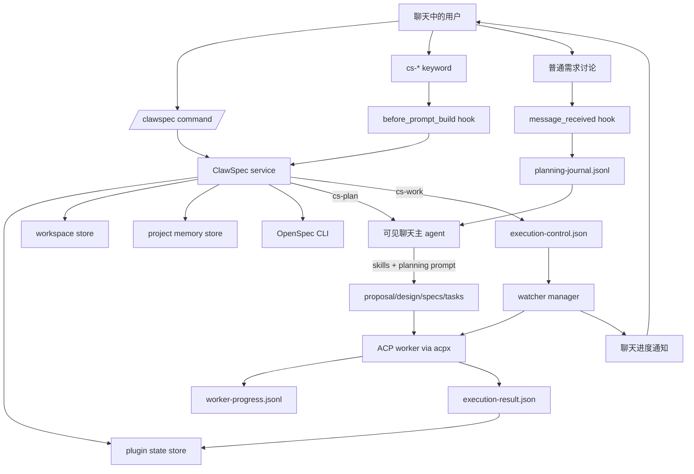
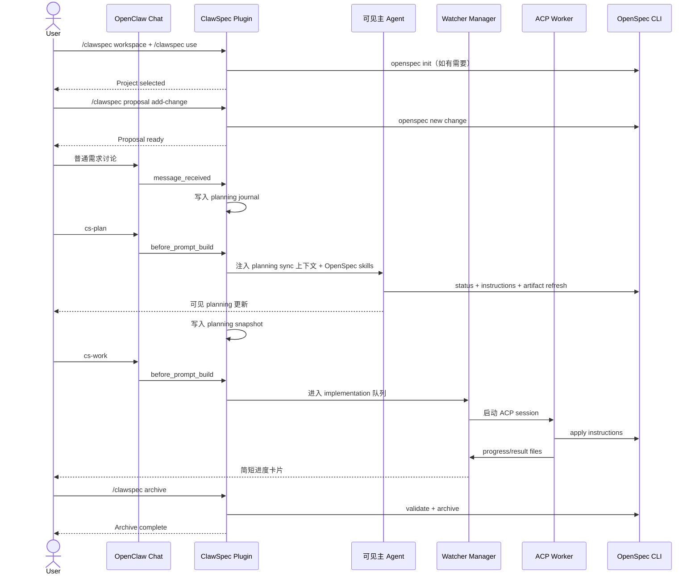
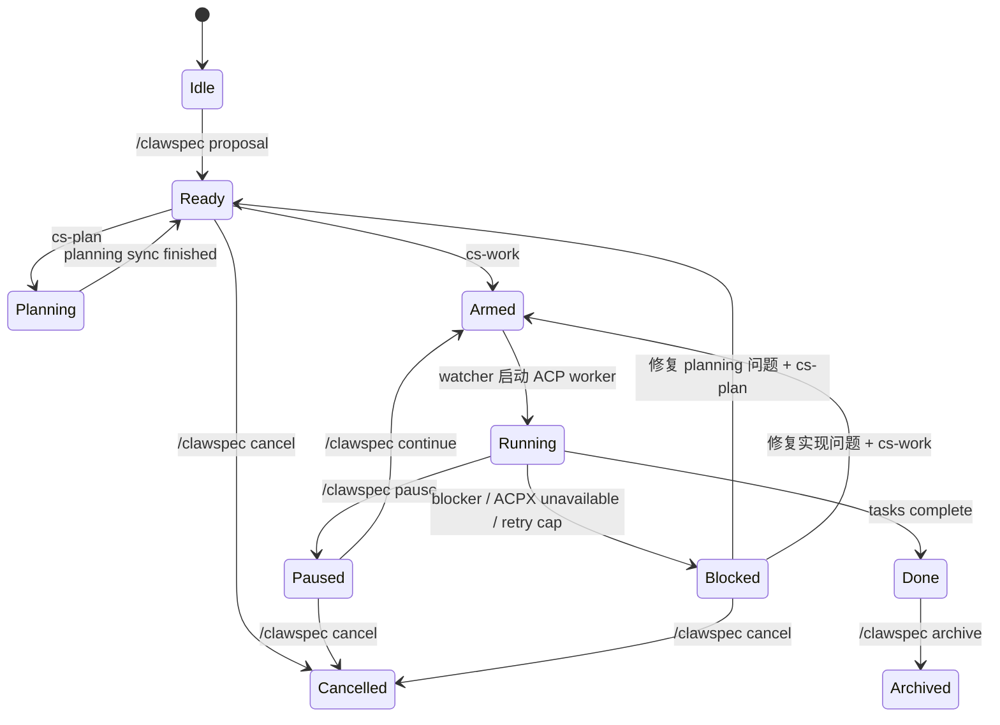

# ClawSpec

[English](./README.md)

ClawSpec 是一个把 OpenSpec 工作流嵌入 OpenClaw 聊天窗口的插件。它有意把“项目控制”和“执行触发”分成两层：

- `/clawspec ...` 负责 workspace、project、change、恢复状态等直接控制。
- `cs-*` 关键字负责在当前聊天里触发工作。
- `cs-plan` 在当前可见聊天回合里执行 planning sync。
- `cs-work` 通过 watcher + ACP worker 在后台执行实现，并把简短进度消息回推到聊天窗口。

这样做的目的，是让 OpenSpec 既保持聊天式体验，又不会把长时间实现任务硬塞进主聊天回合里。

## 一眼看懂

- workspace 按 chat channel 记忆，不是全局只有一个。
- 每个 chat channel 只维护一个活动 project。
- 同一个 repo 在所有 channel 中只允许存在一个未完成 change。
- 在 attached 状态下，需求讨论会写入 planning journal。
- `cs-plan` 只刷新 `proposal.md`、`design.md`、`specs`、`tasks.md`，不写业务代码。
- `cs-work` 会把 `tasks.md` 变成后台执行任务，并由 watcher 负责推进度和恢复。
- `/clawspec cancel` 通过快照回滚变更，不会做整仓库 Git reset。
- `/clawspec archive` 在任务完成后归档 OpenSpec change，并清掉当前聊天里的活动 change。

## 为什么命令面要拆开

ClawSpec 使用两套入口，是因为它们解决的是两类完全不同的问题：

| 入口 | 示例 | 负责什么 | 为什么需要它 |
| --- | --- | --- | --- |
| Slash command | `/clawspec use`、`/clawspec proposal`、`/clawspec status` | 直接插件控制、目录初始化、状态查询 | 快、确定性强，不依赖 agent 回合 |
| 聊天关键字 | `cs-plan`、`cs-work`、`cs-pause` | 在当前聊天里注入工作流上下文，或排队后台执行 | 让 planning 可见、让实现可恢复 |

实际使用时：

- 用 `/clawspec ...` 管项目和状态。
- 用 `cs-plan` 让当前可见聊天回合去刷新 planning artifacts。
- 用 `cs-work` 让 watcher 启动后台实现。

## 架构图



## 各动作到底跑在哪

| 动作 | 运行位置 | 用户是否可见 | 会写什么 |
| --- | --- | --- | --- |
| `/clawspec workspace` | 插件命令处理器 | 直接回复 | Workspace 状态 |
| `/clawspec use` | 插件命令处理器，必要时跑 `openspec init` | 直接回复 | Project 选择、OpenSpec 初始化 |
| `/clawspec proposal` | 插件命令处理器，跑 `openspec new change` | 直接回复 | Change 脚手架、快照基线、planning 初始状态 |
| 普通需求讨论 | 主聊天 agent + prompt 注入 | 可见 | Planning journal，不改 artifact |
| `cs-plan` | 当前可见聊天回合 | 可见 | Planning artifacts、journal snapshot |
| `cs-work` | Watcher + ACP worker | 只看到简短进度回报 | 代码、`tasks.md`、runtime 支持文件 |
| `/clawspec continue` | 插件根据当前 phase 决定恢复 planning 还是 work | 直接回复，之后进入相应流程 | Execution 状态 |

## 环境要求

- 一份较新的 OpenClaw，支持插件 hooks 和 ACP runtime。
- Gateway 主机上有 Node.js `>= 24`。
- 如果需要自动安装 OpenSpec，则主机上还需要 `npm`。
- 用于可见 planning 的 agent 需要具备 shell 和文件编辑能力。
- 后台实现依赖 ACP backend `acpx`。

ClawSpec 依赖这几个 OpenClaw hook：

- `message_received`
- `before_prompt_build`
- `agent_end`

如果宿主全局禁用了插件 hooks，那么基于关键字的工作流就跑不起来。

## 安装

### 1. 安装插件

本地联动安装示例：

```powershell
openclaw plugins install -l C:\Users\Administrator\rax-plugin\clawspec
```

以后如果你把 ClawSpec 打包发布，也可以按普通 OpenClaw 插件的方式安装。下面的说明默认插件已经被 OpenClaw 发现。

### 2. 在 OpenClaw 里启用 ACP 和 ACPX

示例 `~/.openclaw/openclaw.json`：

```json
{
  "acp": {
    "enabled": true,
    "backend": "acpx",
    "defaultAgent": "codex"
  },
  "plugins": {
    "entries": {
      "acpx": {
        "enabled": true,
        "config": {
          "permissionMode": "approve-all",
          "expectedVersion": "any"
        }
      },
      "clawspec": {
        "enabled": true,
        "config": {
          "defaultWorkspace": "~/clawspec/workspace",
          "workerAgentId": "codex",
          "openSpecTimeoutMs": 120000,
          "watcherPollIntervalMs": 4000
        }
      }
    }
  }
}
```

这里要注意：

- 新版 OpenClaw 往往已经自带 `acpx`，这时通常只需要启用它。
- 如果你的 OpenClaw 没有自带 `acpx`，那就要先单独安装或加载 `acpx`。
- ClawSpec 自己不携带 ACP runtime backend。
- 当 ACPX 不可用时，watcher 会在聊天里发一条简短提示，告诉用户去启用 `plugins.entries.acpx` 和 backend `acpx`。

### 3. 重启 gateway

```powershell
openclaw gateway restart
openclaw gateway status
```

### 4. 了解 OpenSpec 的自动引导逻辑

ClawSpec 启动时会按这个顺序检查 `openspec`：

1. 插件本地 `node_modules/.bin` 下的二进制
2. 系统 `PATH` 上的 `openspec`
3. 如果都没有，可能执行：

```powershell
npm install --omit=dev --no-save @fission-ai/openspec
```

这意味着如果 gateway 主机上本来没有 `openspec`，它可能需要网络访问和可用的 `npm`。

## 快速开始

```text
/clawspec workspace "D:\dev"
/clawspec use "demo-app"
/clawspec proposal add-login-flow "Build login and session handling"
在聊天里继续描述需求
cs-plan
cs-work
/clawspec status
/clawspec archive
```

这 8 步分别发生了什么：

1. `/clawspec workspace` 为当前 chat channel 选择 workspace。
2. `/clawspec use` 在该 workspace 下选择或创建项目目录，必要时执行 `openspec init`。
3. `/clawspec proposal` 创建 OpenSpec change 脚手架和回滚快照基线。
4. 普通聊天讨论会被写入 planning journal。
5. `cs-plan` 在当前可见聊天回合里刷新 planning artifacts。
6. `cs-work` 激活 watcher，并启动后台实现。
7. Watcher 把简短进度消息回推到同一个聊天窗口。
8. `/clawspec archive` 校验并归档已完成 change。

## Slash 命令

| 命令 | 作用 |
| --- | --- |
| `/clawspec workspace [path]` | 查看当前 workspace，或切换当前 chat channel 的 workspace |
| `/clawspec use <project-name>` | 在当前 workspace 里选择或创建项目 |
| `/clawspec proposal <change-name> [description]` | 创建新的 OpenSpec change 和回滚基线 |
| `/clawspec worker [agent-id]` | 查看或设置当前 channel/project 的后台 worker agent |
| `/clawspec worker status` | 查看实时 worker 状态、当前任务、session、heartbeat |
| `/clawspec attach` | 把普通聊天重新接入当前 ClawSpec 上下文 |
| `/clawspec detach` | 把普通聊天从当前 ClawSpec 上下文中分离 |
| `/clawspec deattach` | `/clawspec detach` 的兼容别名 |
| `/clawspec continue` | 根据当前 phase 恢复 planning 或 implementation |
| `/clawspec pause` | 请求在下一个安全边界暂停后台执行 |
| `/clawspec status` | 对齐并渲染当前项目状态 |
| `/clawspec archive` | 校验并归档已完成的 change |
| `/clawspec cancel` | 回滚快照、删除 change、清理 runtime 状态 |

辅助 host CLI：

| 命令 | 作用 |
| --- | --- |
| `clawspec-projects` | 列出已经记忆的 workspace |

## 聊天关键字

这些关键字是作为普通聊天消息发送的。

| 关键字 | 作用 |
| --- | --- |
| `cs-plan` | 在当前聊天回合里执行可见 planning sync |
| `cs-work` | 启动后台实现 |
| `cs-attach` | 把普通聊天重新接回 project mode |
| `cs-detach` | 把普通聊天从 project mode 中分离 |
| `cs-deattach` | `cs-detach` 的兼容别名 |
| `cs-pause` | 协作式暂停后台执行 |
| `cs-continue` | 恢复 planning 或 implementation |
| `cs-status` | 查看当前项目状态 |
| `cs-cancel` | 取消当前 change |

## 端到端工作流



## Attached 与 Detached

ClawSpec 会为每个 chat channel 维护一个 `contextMode`：

| 模式 | 含义 |
| --- | --- |
| `attached` | 普通聊天会带 ClawSpec prompt 注入，需求消息会进入 planning journal |
| `detached` | 普通聊天回到正常模式；后台 watcher 的进度消息仍然会继续出现 |

如果你想让后台实现继续跑，但当前窗口要去聊别的事情，就应该切到 detached。

## Planning Journal 与 Dirty 机制

ClawSpec 的 planning journal 在这里：

```text
<repo>/.openclaw/clawspec/planning-journal.jsonl
```

记录规则如下：

- active change 且 context attached 时，用户需求消息会写入 journal。
- 有价值的 assistant 回复也会写入 journal。
- 被动的流程提示、控制类消息会被过滤。
- 命令和 `cs-*` 关键字不会被当成 planning 内容写入。
- 成功执行 `cs-plan` 后，会写一份 journal snapshot。
- 如果 snapshot 之后又来了新的需求讨论，journal 就会变成 `dirty`。

所以你会看到这种行为：

- 你聊了新需求
- journal 变脏
- `cs-work` 被阻止
- 插件要求你先 `cs-plan`

这是为了避免在过期 artifacts 上继续实现。

## 可见 Planning

`cs-plan` 不走后台 ACP worker，而是直接在当前可见聊天回合里执行。ClawSpec 会向主聊天 agent 注入：

- 当前 active change 的上下文
- planning journal
- 从 `.codex/skills` 读取的 OpenSpec skill 原文

当前 skill 映射：

| 模式 | 注入的 skills |
| --- | --- |
| 普通 planning 讨论 | `openspec-explore`、`openspec-propose` |
| `cs-plan` planning sync | `openspec-explore`、`openspec-propose` |
| `cs-work` implementation | `openspec-apply-change` |

Planning prompt 还会显式约束主聊天 agent：

- 没有明确 `cs-plan` 时，不得自行开始 planning sync
- 普通 planning 讨论时不得实现代码
- 不得静默切换到别的 change
- 不得无意义扫描兄弟 change 目录

## 后台 Implementation

`cs-work` 做三件事：

1. 执行 `openspec status` 和 `openspec instructions apply --json`
2. 写入 `execution-control.json` 并激活 watcher
3. 由 watcher 通过 `acpx` 启动 ACP worker

之后 watcher 会负责：

- 发启动提示
- 发 “ACP worker connected” 提示
- 从 `worker-progress.jsonl` 读取进度
- 对齐 `execution-result.json`
- 更新 project 状态
- 对可恢复的 ACP 故障做有上限的重试
- 在 ACPX 不可用时给出简短可操作的提示

## 恢复与重启模型

ClawSpec 设计目标之一就是“后台工作可恢复”：

- gateway 启动时：watcher manager 会扫描活动项目并恢复可继续的任务
- gateway 停止时：活动后台 session 会被关闭，但会留下可恢复状态
- ACP worker 崩溃时：watcher 会对可恢复故障做退避重试
- 达到重试上限时：项目进入 `blocked`

这也是为什么 `cs-work` 不直接把全部实现塞进单个可见聊天回合里。

## 生命周期模型

真实实现里同时追踪 `status` 和 `phase`。下面是简化版状态图：



## 文件与存储

OpenClaw 全局插件状态：

```text
<openclaw-state-dir>/clawspec/
  active-projects.json
  project-memory.json
  workspace-state.json
  projects/
    <projectId>.json
```

Repo 本地 runtime 状态：

```text
<repo>/.openclaw/clawspec/
  state.json
  execution-control.json
  execution-result.json
  worker-progress.jsonl
  progress.md
  changed-files.md
  decision-log.md
  latest-summary.md
  planning-journal.jsonl
  planning-journal.snapshot.json
  rollback-manifest.json
  snapshots/
    <change-name>/
      baseline/
  archives/
    <projectId>/
```

OpenSpec change 本身仍然放在标准目录：

```text
<repo>/openspec/changes/<change-name>/
  .openspec.yaml
  proposal.md
  design.md
  tasks.md
  specs/
```

## 运行边界

- Workspace 按 channel 记忆。
- 每个 channel 只维护一个 active project。
- 同一个 repo 跨 channel 只允许一个未完成 change。
- `tasks.md` 仍然是任务真相源。
- OpenSpec 仍然是工作流语义的真相源。
- `/clawspec cancel` 不会执行整仓库级别的 `git reset --hard`。
- Detached 模式只会停止 prompt 注入和 journal 记录，不会停止 watcher 推送。

## 常见排障

### `cs-work` 提示需要先 planning sync

原因可能是：

- planning journal 是 dirty
- planning artifacts 缺失或过期
- OpenSpec apply state 仍是 blocked

处理方式：

1. 如果需求还没聊完，继续聊
2. 运行 `cs-plan`
3. 再运行 `cs-work`

### Watcher 提示 ACPX 不可用

常见原因：

- `acp.enabled` 没开
- `acp.backend` 不是 `acpx`
- `plugins.entries.acpx.enabled` 没开
- 你的 OpenClaw 没有自带 ACPX，也没有单独安装/加载

处理方式：

1. 打开 ACP
2. 把 backend 设成 `acpx`
3. 启用 `plugins.entries.acpx`
4. 如果宿主没自带 ACPX，就先安装或加载它
5. 再运行 `cs-work` 或 `/clawspec continue`

### 普通聊天污染了 planning journal

可以用：

```text
cs-detach
```

或者：

```text
/clawspec detach
```

之后如果需要再接回来，使用 `cs-attach` 或 `/clawspec attach`。

### `/clawspec use` 提示已有 unfinished change

这是预期行为。ClawSpec 会阻止你在同一个 repo 上静默丢下一个活动 change。

此时应该做以下之一：

- `/clawspec continue`
- `/clawspec cancel`
- `/clawspec archive`

### Cancel 没有恢复整个仓库

这是设计如此。Cancel 只会恢复 ClawSpec 为当前 change 跟踪的文件快照，而不是做整仓库级别的 Git 还原。

## 开发与验证

开发时常用检查：

```powershell
node --experimental-strip-types -e "import('./src/index.ts')"
node --experimental-strip-types --test test/watcher-work.test.ts
```

手工验证流程：

```text
/clawspec workspace "D:\dev"
/clawspec use "demo-app"
/clawspec proposal add-something "Build something"
在聊天中继续描述需求
cs-plan
cs-work
cs-status
/clawspec worker status
/clawspec pause
/clawspec continue
/clawspec archive
```

## 实现总结

ClawSpec 本质上不是“多写几段 prompt”这么简单。它是一个把以下几层拼起来的编排层：

- OpenClaw hooks，用于控制可见聊天行为
- OpenSpec CLI，用于保证工作流语义一致
- planning journal 和 snapshot，用于跟踪需求变化
- watcher manager，用于让后台任务具备恢复性
- ACP worker，用于承载长时间实现任务

也正因为这个拆分，ClawSpec 才能做到一边保持 planning 的聊天体验，一边让 implementation 具备可恢复、可暂停、可继续的后台执行能力。
